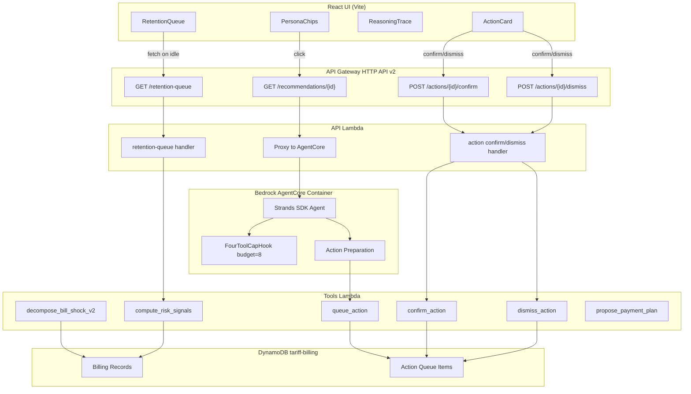

# Design Document: Agentic Actions Portfolio

## Overview

This design extends the Customer Tariff demo from a read-only advisor into an agentic actor with portfolio awareness. Three connected capabilities are delivered:

1. **Agent-as-Actor (AGENT-04):** The agent prepares confirmable actions (tariff switch, SMS follow-up, payment plan offer) that the rep approves with one click. The "agent prepares, human approves" pattern keeps the human in the loop while reducing friction.

2. **Bill-Shock Root-Cause Decomposition:** The existing `decompose_bill_shock` tool output is enriched with a structured `Contributing_Factors` list (factor_name, dollar_amount, percentage_of_total) and a code-composed `explanation_sentence`. The FourToolCapHook budget is bumped from the current 8 to accommodate the expanded chain.

3. **Retention Queue / Cohort Landing Page:** A portfolio-level landing page replaces the EmptyState, showing all seed personas ranked by a deterministic risk signal. A new `GET /retention-queue` endpoint serves the data. Click-to-investigate triggers the existing recommendation flow.

All changes preserve SAV-03, REC-03, D-04, D-15, and the frozen `demo-v2.0` lockfiles.

## Architecture



### Design Decisions

1. **Action Queue in DynamoDB (same table):** Actions are stored as items in the existing `tariff-billing` table with a `customer_id` partition key and `month` sort key of format `ACTION#{action_id}`. This avoids a new table while keeping the action lifecycle queryable. TTL is handled by DynamoDB's native TTL feature on an `expires_at` attribute.

2. **Actions are fire-and-forget from the agent's perspective:** The agent calls `queue_action` after producing the recommendation. If `queue_action` fails, the recommendation is still returned with an empty `pending_actions` list (D-04 preserved). Action preparation never blocks the primary response.

3. **Retention queue is fully deterministic:** The `compute_risk_signals` function runs in the Tools Lambda with no LLM involvement. The risk score formula is a weighted sum of bill-shock magnitude, usage trend, and hardship flag — all derived from existing billing data.

4. **Budget stays at 8:** The current `FourToolCapHook(budget=8)` already accommodates the expanded tool gallery. The decomposition chain (get_billing_history → detect_bill_shock → decompose_bill_shock → simulate_savings + action prep) fits within 6 calls for shock customers. Non-shock customers use 3-4 calls (get_hardship_flag → simulate_savings → queue_action). No budget change needed.

5. **Explanation sentence is code-composed:** The `explanation_sentence` is built by string formatting in `decompose_bill_shock_pure` from the Contributing_Factors — never touches the LLM (SAV-03).

6. **New API routes go through API Lambda:** `GET /retention-queue` and `POST /actions/{id}/confirm|dismiss` are handled directly by the API Lambda (no AgentCore invocation needed) since they call Tools Lambda pure functions.

## Components and Interfaces

### 1. Action Queue (Tools Lambda)

Three new pure functions in `lambda/handler.py`:

```python
def queue_action(action: dict) -> dict:
    """Validate and store a Confirmable_Action. Returns action_id + status."""

def confirm_action(action_id: str) -> dict:
    """Transition action from pending → confirmed. Returns updated action."""

def dismiss_action(action_id: str) -> dict:
    """Transition action from pending → rejected. Returns updated action."""
```

### 2. Bill-Shock Decomposition v2 (Tools Lambda)

Enriches the existing `decompose_bill_shock_pure` output with:
- `contributing_factors`: list of `{factor_name, dollar_amount, percentage_of_total}`
- `explanation_sentence`: code-composed string

### 3. Risk Signal Computation (Tools Lambda)

```python
def compute_risk_signals(customer_ids: list[str]) -> dict:
    """Compute and rank risk signals for a list of customers."""
```

### 4. Action Preparation (Agent)

Post-recommendation hook in `invoke()` that calls `queue_action` for each applicable action type based on the recommendation and bill-shock state.

### 5. API Lambda Extensions

- `GET /retention-queue` → calls `compute_risk_signals` → returns ranked list
- `POST /actions/{action_id}/confirm` → calls `confirm_action`
- `POST /actions/{action_id}/dismiss` → calls `dismiss_action`

### 6. UI Components

- `RetentionQueue` — replaces EmptyState in idle state
- `CohortCard` — individual customer risk card within RetentionQueue
- `ActionCard` — confirmable action card below recommendation cards

## Data Models

### Confirmable_Action (DynamoDB Item)

```python
class ConfirmableAction(BaseModel):
    action_id: str = Field(description="UUID v4 identifier")
    action_type: Literal["tariff_switch", "send_sms", "payment_plan_offer"]
    customer_id: str = Field(description="CUST-NNN format")
    payload: dict = Field(description="Type-specific action data")
    status: Literal["pending", "confirmed", "rejected"]
    created_at: str = Field(description="ISO 8601 timestamp")
    expires_at: int = Field(description="Unix epoch for DynamoDB TTL")
```

### Tariff Switch Payload

```python
{
    "plan_id": str,          # from simulate_savings
    "plan_name": str,        # from simulate_savings
    "effective_date": str,   # ISO date, computed by Tools Lambda
    "estimated_saving_monthly": float  # from simulate_savings
}
```

### SMS Payload

```python
{
    "message_body": str,     # ≤160 chars, D-15 validated
    "plan_name": str         # referenced plan name
}
```

### Payment Plan Payload

```python
{
    "proposed_installments": int,    # from propose_payment_plan
    "installment_amount": float,     # from propose_payment_plan
    "total_owed": float              # from propose_payment_plan
}
```

### Contributing_Factor

```python
class ContributingFactor(BaseModel):
    factor_name: Literal[
        "rate_increase", "usage_spike",
        "seasonal_variation", "billing_day_difference"
    ]
    dollar_amount: float
    percentage_of_total: float
```

### Bill_Shock_Decomposition (enriched output)

```python
{
    "customer_id": str,
    "is_shock": bool,
    "shock_month": str,
    "total_delta_dollars": float,
    "contributing_factors": [ContributingFactor],
    "explanation_sentence": str,
    "explanation_factors": [str]  # backward compat
}
```

### Risk_Signal

```python
class RiskSignal(BaseModel):
    customer_id: str
    risk_score: int          # 0-100, higher = more urgent
    risk_summary: str        # code-composed one-liner
    bill_shock_detected: bool
    usage_trend: Literal["increasing", "decreasing", "stable"]
    hardship_flag: bool
```

### RecommendationResponse Extension

```python
class RecommendationResponse(BaseModel):
    kind: str = "recommendation"
    green: TrackInfo
    cheapest: TrackInfo
    reasoning_trace: list[ReasoningTraceEntry] = []
    pending_actions: list[ConfirmableAction] = []  # NEW
```

### GET /retention-queue Response

```json
{
    "customers_at_risk": 4,
    "queue": [
        {
            "customer_id": "CUST-003",
            "risk_score": 82,
            "risk_summary": "Bill shock: +$45 over baseline",
            "bill_shock_detected": true
        }
    ]
}
```

## Correctness Properties

*A property is a characteristic or behavior that should hold true across all valid executions of a system — essentially, a formal statement about what the system should do. Properties serve as the bridge between human-readable specifications and machine-verifiable correctness guarantees.*

### Property 1: Action State Machine — Confirm

*For any* Confirmable_Action in `pending` status (regardless of action_type), calling `confirm_action` with its action_id SHALL transition the status to `confirmed` and return the updated action.

**Validates: Requirements 1.3, 2.3, 3.3**

### Property 2: Action State Machine — Dismiss

*For any* Confirmable_Action in `pending` status, calling `dismiss_action` with its action_id SHALL transition the status to `rejected` and return the updated action.

**Validates: Requirements 1.4**

### Property 3: Expired Actions Rejected

*For any* Confirmable_Action whose `expires_at` timestamp is in the past, calling `confirm_action` or `dismiss_action` SHALL return an expiry error and leave the action status unchanged.

**Validates: Requirements 1.5**

### Property 4: Action Payload SAV-03 Compliance

*For any* tariff_switch or payment_plan_offer Confirmable_Action produced by the agent, the numeric fields (`estimated_saving_monthly`, `installment_amount`, `total_owed`) SHALL exactly match the output of the corresponding Tools Lambda pure function (`simulate_savings_pure`, `propose_payment_plan_pure`) for that customer.

**Validates: Requirements 1.6, 3.2**

### Property 5: SMS Body Validation

*For any* `send_sms` Confirmable_Action produced by the agent, the `message_body` field SHALL have length ≤ 160 characters AND SHALL pass D-15 validation (no digits, currency symbols, percentages, competitor names, or switch verbs).

**Validates: Requirements 2.1, 2.2**

### Property 6: Payment Plan Offer Conditional

*For any* bill-shock decomposition result, a `payment_plan_offer` action SHALL be produced if and only if `is_shock` is `true` AND `total_delta_dollars` exceeds $50. When `total_delta_dollars` is $50 or less, no `payment_plan_offer` SHALL be produced.

**Validates: Requirements 3.1, 3.4**

### Property 7: Decomposition Sum Invariant

*For any* valid billing history with at least 2 months, the sum of all Contributing_Factor `dollar_amount` values in the decomposition output SHALL equal `total_delta_dollars` within a tolerance of $0.01.

**Validates: Requirements 5.2, 5.6**

### Property 8: Decomposition Percentage Sum Invariant

*For any* decomposition result with a non-zero `total_delta_dollars`, the sum of all Contributing_Factor `percentage_of_total` values SHALL equal 100 within a tolerance of 1 percentage point.

**Validates: Requirements 5.3**

### Property 9: Zero-Rate Factor Omission

*For any* billing history where no rate change has occurred, the `rate_increase` Contributing_Factor SHALL have a `dollar_amount` of $0.00 AND SHALL be omitted from the `explanation_factors` list.

**Validates: Requirements 5.5**

### Property 10: Explanation Sentence Format

*For any* decomposition result with Contributing_Factors, the `explanation_sentence` SHALL match the format `"$X over baseline — Y% from [cause A], Z% from [cause B], ..."` where X equals `total_delta_dollars` and the percentages correspond to the Contributing_Factor `percentage_of_total` values.

**Validates: Requirements 6.1**

### Property 11: Risk Signal Range Invariant

*For any* valid combination of bill-shock magnitude, usage trend direction, and hardship flag status, the `compute_risk_signals` function SHALL produce a `risk_score` in the range [0, 100].

**Validates: Requirements 9.3, 9.5**

### Property 12: Hardship Caps Risk at Zero

*For any* customer with `hardship_flag: true`, the `compute_risk_signals` function SHALL return a `risk_score` of 0.

**Validates: Requirements 9.4**

### Property 13: Risk Signal Sort Invariant

*For any* list of customer_ids passed to `compute_risk_signals`, the output list SHALL be sorted in descending order by `risk_score`.

**Validates: Requirements 9.6**

### Property 14: Queue Action Validation

*For any* valid Confirmable_Action payload (correct action_type, valid customer_id, well-formed payload), `queue_action` SHALL store it with `status: "pending"` and an `expires_at` timestamp 24 hours in the future. For any invalid payload, `queue_action` SHALL reject with a validation error.

**Validates: Requirements 1.2**

## Error Handling

### Action Preparation Failures (D-04 Extended)

- If `queue_action` fails during action preparation, the agent returns the recommendation with `pending_actions: []`. The primary recommendation is never blocked by action failures.
- If the LLM-generated SMS body fails D-15 validation, the agent substitutes a pre-approved fallback from `FALLBACKS[customer_id]`.

### API Lambda Error Mapping

| Scenario | HTTP Status | Body |
|----------|-------------|------|
| Action not found | 404 | `{"error": "Action not found"}` |
| Action expired | 410 | `{"error": "Action has expired"}` |
| Action already confirmed/rejected | 409 | `{"error": "Action already processed"}` |
| Tools Lambda failure (retention-queue) | 502 | `{"error": "Upstream service error"}` |
| Invalid action_id format | 400 | `{"error": "Invalid action_id"}` |

### Retention Queue Failures

- If `compute_risk_signals` fails, `GET /retention-queue` returns HTTP 502 with a JSON error body (D-04 never-500 preserved at the API layer).
- The UI falls back to the existing EmptyState if the retention queue fetch fails.

### Tool Budget Exhaustion

- The existing `FourToolCapHook` cancellation → `stop_reason == "cancelled"` → D-04 fallback path remains unchanged. The budget of 8 accommodates all flows.

## Testing Strategy

### Property-Based Tests (Hypothesis)

Each correctness property maps to a Hypothesis property test with minimum 100 iterations. Tests target the pure functions in `lambda/handler.py` and the action state machine logic.

**Library:** Hypothesis (already in `requirements-dev.txt`)

**Configuration:** `@settings(max_examples=100)` minimum per property test.

**Tag format:** `# Feature: agentic-actions-portfolio, Property N: <property_text>`

Properties 1-3 (action state machine) test `queue_action`, `confirm_action`, `dismiss_action` with generated action payloads.

Properties 7-10 (decomposition) test `decompose_bill_shock_pure` with generated billing histories.

Properties 11-13 (risk signals) test `compute_risk_signals` with generated customer data combinations.

Property 14 (queue validation) tests `queue_action` with both valid and invalid payloads.

### Unit Tests (pytest)

- Action Card UI component rendering (confirm/dismiss states, loading, error)
- Retention Queue rendering with mock data
- API Lambda route handling for new endpoints
- SMS fallback substitution when D-15 fails
- `?narrative=off` hides Action_Cards but shows Retention_Queue
- Backward compatibility: existing endpoints unchanged

### Integration Tests (pytest -m smoke)

- End-to-end action lifecycle: queue → confirm → verify status
- Retention queue endpoint returns ranked data for all personas
- SSE streaming still works with pending_actions in result payload
- Existing persona flows (CUST-001 through CUST-006) produce valid responses

### UI Tests (vitest)

- RetentionQueue component renders Cohort_Cards sorted by risk
- ActionCard confirm/dismiss click handlers
- State transitions: idle → RetentionQueue, click → loading → success
- `?narrative=off` kill-switch behavior
