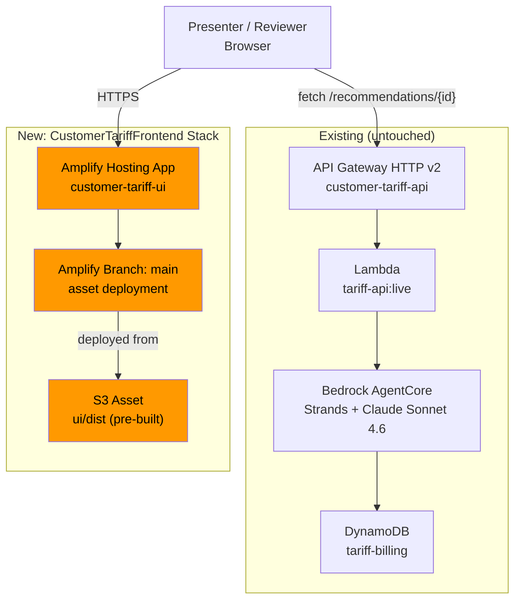
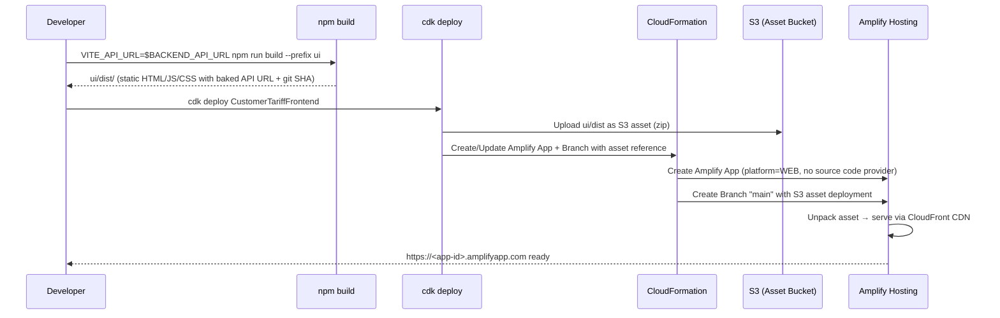
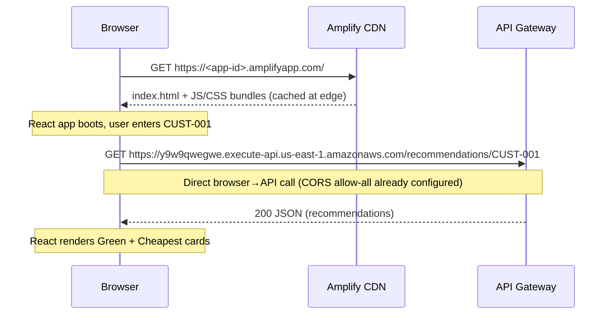

# Design Document: Amplify Frontend Hosting

## Overview

This feature replaces the current `vite preview` localhost approach for the Customer Tariff & Billing Optimisation Agent demo UI with AWS Amplify Hosting, providing a stable, shareable HTTPS URL (e.g., `https://<app-id>.amplifyapp.com`). The backend (API Gateway → Lambda → Bedrock AgentCore → DynamoDB) remains completely untouched.

The approach uses the CDK `aws_amplify_alpha` construct library's asset-based deployment pattern — no Git source code provider is needed. A pre-built `ui/dist` directory is packaged as an S3 asset and deployed to Amplify Hosting via a new CDK stack (`CustomerTariffFrontend`). This keeps the deployment model simple: build locally with the desired `VITE_API_URL`, then `cdk deploy` the static output. Both live-API and mock-mode builds are supported through the existing `build` / `build:mock` npm scripts, with the `VITE_API_URL` env var baked at build time as before.

The `?narrative=off` kill switch, version indicator (`v2.0 · <sha>`), and all existing UI behaviour are preserved — they are baked into the Vite build output and require no server-side support. The SPA redirect rule (`CustomRule.SINGLE_PAGE_APPLICATION_REDIRECT`) ensures client-side routing works correctly on Amplify's CDN.

## Architecture



## Sequence Diagrams

### Deployment Flow



### Runtime Request Flow



## Components and Interfaces

### Component 1: AmplifyHostingConstruct

**Purpose**: CDK L3 construct that provisions an Amplify Hosting app with a single branch deployed from a pre-built S3 asset. Encapsulates all Amplify resource creation following the project's existing construct pattern.

**Interface**:
```python
class AmplifyHostingConstruct(Construct):
    def __init__(
        self,
        scope: Construct,
        construct_id: str,
        *,
        asset_path: str,       # Path to pre-built dist directory (e.g., "ui/dist")
    ) -> None: ...

    @property
    def app_url(self) -> str:
        """The default Amplify app URL (https://<branch>.<app-id>.amplifyapp.com)."""
        ...

    @property
    def app_id(self) -> str:
        """The Amplify app ID."""
        ...
```

**Responsibilities**:
- Create an Amplify App with `platform=WEB` (static-only, no SSR compute)
- Add the SPA redirect rule (`CustomRule.SINGLE_PAGE_APPLICATION_REDIRECT`) so deep-links and `?narrative=off` query params work
- Add custom security response headers (X-Content-Type-Options, X-Frame-Options, Referrer-Policy)
- Create a `main` branch with the S3 asset deployment
- Expose the app URL and app ID as properties for CfnOutput

### Component 2: FrontendStack

**Purpose**: New CDK stack (`CustomerTariffFrontend`) that wires the AmplifyHostingConstruct and exports the Amplify URL as a CloudFormation output.

**Interface**:
```python
class FrontendStack(Stack):
    def __init__(self, scope: Construct, construct_id: str, **kwargs) -> None: ...
```

**Responsibilities**:
- Instantiate `AmplifyHostingConstruct` with `asset_path="ui/dist"`
- Export `AmplifyAppUrl` and `AmplifyAppId` as CfnOutputs
- No cross-stack dependencies — this stack is fully independent of the existing 3 stacks

### Component 3: Updated CDK Entry Point (app.py)

**Purpose**: Register the new `FrontendStack` in the CDK app alongside the existing 3 stacks.

**Interface**: No new interface — extends existing `app.py` with one additional stack instantiation.

**Responsibilities**:
- Import and instantiate `FrontendStack` with `env=cdk.Environment(region="us-east-1")`
- Maintain the existing 3 stacks unchanged

## Data Models

### Amplify App Configuration

```python
# No new data models are introduced. The Amplify construct uses CDK's
# built-in types. The key configuration values are:

amplify_app_config = {
    "app_name": "customer-tariff-ui",
    "platform": Platform.WEB,           # Static-only (no SSR)
    "branch_name": "main",              # Single branch for the deployed asset
    "asset_path": "ui/dist",            # Pre-built Vite output directory
    "custom_rules": [
        CustomRule.SINGLE_PAGE_APPLICATION_REDIRECT,  # SPA 200-rewrite
    ],
}
```

**Validation Rules**:
- `asset_path` must point to an existing directory containing at least `index.html`
- The directory must be a valid Vite build output (contains `assets/` subdirectory with hashed JS/CSS bundles)
- `VITE_API_URL` is baked at build time — the Amplify deployment does not set or override environment variables

### Build Mode Matrix

| Build Command | `VITE_API_URL` Value | Amplify Behaviour | Use Case |
|---|---|---|---|
| `VITE_API_URL=$BACKEND_API_URL npm run build --prefix ui` | Live API endpoint | Browser calls real API Gateway | Primary demo |
| `npm run build:mock --prefix ui` | Empty string | Browser uses local mock fixtures | Fallback demo |

## Algorithmic Pseudocode

### Deployment Algorithm

```pascal
ALGORITHM deployFrontendToAmplify(apiUrl, distPath)
INPUT: apiUrl (string, may be empty for mock mode), distPath (string, default "ui/dist")
OUTPUT: amplifyUrl (string, the HTTPS URL of the deployed app)

BEGIN
  // Step 1: Build the UI with the desired API URL baked in
  IF apiUrl IS NOT EMPTY THEN
    EXECUTE "VITE_API_URL={apiUrl} npm run build --prefix ui"
  ELSE
    EXECUTE "npm run build:mock --prefix ui"
  END IF

  // Step 2: Verify the build output exists
  ASSERT fileExists("{distPath}/index.html")
  ASSERT directoryExists("{distPath}/assets")

  // Step 3: Deploy via CDK
  EXECUTE "cdk deploy CustomerTariffFrontend"
  // CDK packages distPath as S3 asset, creates/updates Amplify app + branch

  // Step 4: Retrieve the Amplify URL from stack outputs
  amplifyUrl ← getStackOutput("CustomerTariffFrontend", "AmplifyAppUrl")

  ASSERT amplifyUrl STARTS WITH "https://"
  ASSERT amplifyUrl ENDS WITH ".amplifyapp.com"

  RETURN amplifyUrl
END
```

**Preconditions:**
- `ui/dist` or `ui/dist-mock` has been built via the appropriate npm script
- AWS credentials are configured for account 588738606436, region us-east-1
- CDK is bootstrapped in the target account/region

**Postconditions:**
- Amplify app is accessible at the returned HTTPS URL
- The app serves the same content as `vite preview` would locally
- `?narrative=off` query parameter works (SPA redirect rule in place)
- Version indicator shows the correct git SHA

### CDK Construct Wiring Algorithm

```pascal
ALGORITHM createAmplifyHostingConstruct(scope, assetPath)
INPUT: scope (CDK Construct), assetPath (string path to dist directory)
OUTPUT: construct with app_url and app_id properties

BEGIN
  // Step 1: Package the dist directory as an S3 asset
  asset ← S3Asset(scope, "FrontendAsset", path=assetPath)

  // Step 2: Create Amplify App (no source code provider = asset-based deployment)
  app ← AmplifyApp(scope, "AmplifyApp",
    app_name="customer-tariff-ui",
    platform=Platform.WEB,
    custom_rules=[CustomRule.SINGLE_PAGE_APPLICATION_REDIRECT],
    custom_response_headers=[
      CustomResponseHeader(
        pattern="**/*",
        headers={
          "X-Content-Type-Options": "nosniff",
          "X-Frame-Options": "DENY",
          "Referrer-Policy": "strict-origin-when-cross-origin"
        }
      )
    ]
  )

  // Step 3: Add branch with asset deployment
  branch ← app.addBranch("main", asset=asset)

  // Step 4: Construct the app URL
  // Format: https://main.<app-id>.amplifyapp.com
  appUrl ← Fn.join("", [
    "https://main.",
    app.appId,
    ".amplifyapp.com"
  ])

  RETURN { app_url: appUrl, app_id: app.appId }
END
```

**Preconditions:**
- `assetPath` directory exists and contains a valid Vite build output
- CDK scope is a valid construct within a Stack

**Postconditions:**
- Amplify App resource created with platform=WEB
- SPA redirect rule configured (200 rewrite to index.html)
- Security headers applied to all responses
- Branch "main" created with the S3 asset deployed
- `app_url` is a valid HTTPS URL

**Loop Invariants:** N/A (no loops in construct creation)

## Key Functions with Formal Specifications

### Function 1: AmplifyHostingConstruct.__init__()

```python
def __init__(
    self,
    scope: Construct,
    construct_id: str,
    *,
    asset_path: str,
) -> None: ...
```

**Preconditions:**
- `scope` is a valid CDK Construct (typically a Stack)
- `asset_path` is a relative path to a directory containing `index.html`
- The directory at `asset_path` exists at synth time

**Postconditions:**
- An `amplify.App` resource is created with `platform=WEB`
- A `CustomRule.SINGLE_PAGE_APPLICATION_REDIRECT` is applied
- A branch named `main` is created with the asset deployed
- `self.app_url` returns a valid HTTPS amplifyapp.com URL
- `self.app_id` returns the Amplify app ID string
- No IAM roles beyond what CDK auto-creates for the Amplify app

### Function 2: FrontendStack.__init__()

```python
def __init__(self, scope: Construct, construct_id: str, **kwargs) -> None: ...
```

**Preconditions:**
- `scope` is a valid CDK App
- `ui/dist` directory exists (user has run `npm run build` before `cdk deploy`)

**Postconditions:**
- Stack contains exactly one `AmplifyHostingConstruct`
- Two CfnOutputs exported: `AmplifyAppUrl`, `AmplifyAppId`
- Stack has no dependencies on CustomerTariff, CustomerTariffAgent, or CustomerTariffApi stacks
- Stack can be deployed and destroyed independently

## Example Usage

### Building and Deploying (Live API Mode)

```bash
# 1. Build the UI with the live API URL baked in
export BACKEND_API_URL="https://y9w9qwegwe.execute-api.us-east-1.amazonaws.com/"
VITE_API_URL="$BACKEND_API_URL" npm run build --prefix ui

# 2. Deploy the Amplify stack
cdk deploy CustomerTariffFrontend

# 3. Grab the URL from stack outputs
# Outputs:
#   CustomerTariffFrontend.AmplifyAppUrl = https://main.d1234abcdef.amplifyapp.com
#   CustomerTariffFrontend.AmplifyAppId = d1234abcdef
```

### Building and Deploying (Mock Mode)

```bash
# 1. Build mock-mode dist (no API URL baked in)
npm run build:mock --prefix ui

# 2. Deploy — same stack, different dist content
# Note: build:mock outputs to dist-mock by default, so either:
#   a) Change asset_path in the construct, or
#   b) Copy dist-mock to dist before deploying
cp -r ui/dist-mock/* ui/dist/
cdk deploy CustomerTariffFrontend
```

### CDK Entry Point (app.py) After Change

```python
#!/usr/bin/env python3
import aws_cdk as cdk

from infrastructure.agentcore_stack import AgentCoreStack
from infrastructure.backend_api_stack import BackendApiStack
from infrastructure.foundation_stack import FoundationStack
from infrastructure.frontend_stack import FrontendStack  # NEW

app = cdk.App()

FoundationStack(
    app, "CustomerTariff",
    env=cdk.Environment(region="us-east-1"),
    description="Phase 1: Foundation + Dummy Data",
)

AgentCoreStack(
    app, "CustomerTariffAgent",
    env=cdk.Environment(region="us-east-1"),
    description="Phase 2: AgentCore Agent Runtime",
)

BackendApiStack(
    app, "CustomerTariffApi",
    env=cdk.Environment(region="us-east-1"),
    description="Phase 3: Backend API",
)

FrontendStack(                                          # NEW
    app, "CustomerTariffFrontend",
    env=cdk.Environment(region="us-east-1"),
    description="Amplify Hosting for the demo UI",
)

app.synth()
```

### Construct Implementation

```python
import aws_cdk as cdk
from aws_cdk import CfnOutput, Stack
from aws_cdk import aws_s3_assets as assets
from constructs import Construct

import aws_cdk.aws_amplify_alpha as amplify


class AmplifyHostingConstruct(Construct):
    """Amplify Hosting app deployed from a pre-built static asset."""

    def __init__(
        self,
        scope: Construct,
        construct_id: str,
        *,
        asset_path: str,
    ) -> None:
        super().__init__(scope, construct_id)

        asset = assets.Asset(self, "FrontendAsset", path=asset_path)

        self._app = amplify.App(
            self,
            "AmplifyApp",
            app_name="customer-tariff-ui",
            platform=amplify.Platform.WEB,
            custom_rules=[amplify.CustomRule.SINGLE_PAGE_APPLICATION_REDIRECT],
            custom_response_headers=[
                amplify.CustomResponseHeader(
                    pattern="**/*",
                    headers={
                        "X-Content-Type-Options": "nosniff",
                        "X-Frame-Options": "DENY",
                        "Referrer-Policy": "strict-origin-when-cross-origin",
                    },
                )
            ],
        )

        self._branch = self._app.add_branch("main", asset=asset)

        self._app_url = f"https://main.{self._app.app_id}.amplifyapp.com"

    @property
    def app_url(self) -> str:
        return self._app_url

    @property
    def app_id(self) -> str:
        return self._app.app_id
```

## Correctness Properties

*A property is a characteristic or behavior that should hold true across all valid executions of a system — essentially, a formal statement about what the system should do. Properties serve as the bridge between human-readable specifications and machine-verifiable correctness guarantees.*

### Property 1: Idempotent redeployment (synth determinism)

*For any* valid Build_Output directory, synthesizing the CustomerTariffFrontend stack twice with the same directory content SHALL produce identical CloudFormation templates (same resource definitions, same asset hashes).

**Validates: Requirement 5.3**

### Property 2: Stack independence (no cross-stack references)

*For any* instantiation of the Frontend_Stack, the synthesized CloudFormation template SHALL contain zero cross-stack references (no `Fn::ImportValue`, no stack dependencies) to CustomerTariff, CustomerTariffAgent, or CustomerTariffApi.

**Validates: Requirements 1.3, 5.1, 5.2, 9.2**

### Property 3: Security headers completeness

*For any* synthesized CustomerTariffFrontend template, the Amplify App resource SHALL include custom response headers containing all three required security headers (X-Content-Type-Options: nosniff, X-Frame-Options: DENY, Referrer-Policy: strict-origin-when-cross-origin) applied to the pattern `**/*`.

**Validates: Requirements 3.1, 3.2, 3.3, 3.4**

### Property 4: SPA redirect rule presence

*For any* synthesized CustomerTariffFrontend template, the Amplify App resource SHALL include the SPA redirect custom rule that rewrites non-file paths to index.html with HTTP 200.

**Validates: Requirements 2.1, 2.2, 2.3**

### Property 5: Static platform configuration

*For any* synthesized CustomerTariffFrontend template, the Amplify App resource SHALL have Platform set to WEB (static-only, no SSR compute), ensuring HTTPS-only delivery via CloudFront CDN.

**Validates: Requirements 1.1, 6.1**

## Error Handling

### Error Scenario 1: `ui/dist` Does Not Exist at Synth Time

**Condition**: Developer runs `cdk deploy CustomerTariffFrontend` without first running `npm run build --prefix ui`.
**Response**: CDK synth fails with a clear error from `assets.Asset` — "Cannot find asset at path ui/dist".
**Recovery**: Run the appropriate build command first. This is a developer workflow error, not a runtime error.

### Error Scenario 2: CORS Preflight Failure

**Condition**: Browser on the Amplify domain sends a preflight OPTIONS request to API Gateway, which rejects it.
**Response**: This should not occur — the existing API Gateway has `allow_origins=["*"]`. If it does occur, the UI shows the generic "server error" copy (httpStatus 0).
**Recovery**: Verify API Gateway CORS configuration. No changes needed on the Amplify side.

### Error Scenario 3: Amplify App Deployment Fails

**Condition**: CloudFormation fails to create/update the Amplify app (e.g., service limit, IAM permission issue).
**Response**: `cdk deploy` exits non-zero with CloudFormation error details.
**Recovery**: Check CloudFormation events in the AWS console. Common causes: Amplify service not available in region (us-east-1 is supported), or CDK bootstrap not run.

### Error Scenario 4: Stale Build Deployed

**Condition**: Developer deploys an old `ui/dist` that has a stale `VITE_API_URL` or wrong git SHA.
**Response**: The app loads but either calls the wrong API endpoint or shows an incorrect version indicator.
**Recovery**: Rebuild with the correct env vars and redeploy. The version indicator (`v2.0 · <sha>`) is the visual canary — if the SHA doesn't match the expected commit, the build is stale.

## Testing Strategy

### Unit Testing Approach

**CDK Synth Tests**: Extend the existing `tests/test_cdk_synth.py` pattern to verify the new stack synthesizes correctly.

```python
def test_frontend_stack_synth():
    """CustomerTariffFrontend stack synthesizes without errors."""
    app = cdk.App()
    stack = FrontendStack(app, "TestFrontend", env=cdk.Environment(region="us-east-1"))
    template = Template.from_stack(stack)

    # Verify Amplify App resource exists
    template.resource_count_is("AWS::Amplify::App", 1)

    # Verify Branch resource exists
    template.resource_count_is("AWS::Amplify::Branch", 1)

    # Verify SPA custom rule is present
    template.has_resource_properties("AWS::Amplify::App", {
        "Name": "customer-tariff-ui",
        "Platform": "WEB",
    })
```

**Stack Independence Test**: Verify the frontend stack has no cross-stack dependencies.

```python
def test_frontend_stack_no_cross_stack_deps():
    """Frontend stack must not depend on any other stack."""
    app = cdk.App()
    stack = FrontendStack(app, "TestFrontend", env=cdk.Environment(region="us-east-1"))
    assert stack.dependencies == []
```

### Property-Based Testing Approach

**Property Test Library**: N/A — CDK infrastructure tests are assertion-based, not property-based. The correctness properties above are verified through CDK template assertions and post-deployment smoke tests.

### Integration Testing Approach (Post-Deployment)

After `cdk deploy`, verify the deployed site:

1. **HTTP 200 on root**: `curl -s -o /dev/null -w "%{http_code}" https://<app-url>/` → `200`
2. **SPA redirect**: `curl -s -o /dev/null -w "%{http_code}" https://<app-url>/nonexistent` → `200` (not 404)
3. **Content check**: `curl -s https://<app-url>/ | grep -q '<div id="root">'` → success
4. **Version indicator**: `curl -s https://<app-url>/assets/*.js | grep -q 'v2.0'` → success (if built from demo-v2.0)
5. **API connectivity** (live mode only): Open the Amplify URL in a browser, enter CUST-001, verify recommendations load

## Performance Considerations

- **CDN caching**: Amplify Hosting uses CloudFront under the hood. Vite's content-hashed filenames (`assets/index-abc123.js`) enable aggressive caching with long `max-age` headers. `index.html` is served with short cache TTL so new deployments propagate quickly.
- **No cold start**: Unlike the backend Lambda, the Amplify-hosted frontend has no cold start — it's static files on a CDN. First-byte time is determined by CloudFront edge proximity.
- **Build size**: The Vite production build is typically <500KB gzipped. Amplify's 25MB deployment limit is not a concern.
- **Redeployment speed**: Asset-based Amplify deployments typically complete in 1-2 minutes (S3 upload + CloudFront invalidation).

## Security Considerations

- **HTTPS only**: Amplify Hosting serves all content over HTTPS by default. No HTTP fallback.
- **No secrets in the frontend**: The only "secret" is the API Gateway URL, which is a public endpoint (no auth). It's baked into the JS bundle at build time — this is acceptable for a demo.
- **Security headers**: Custom response headers (X-Content-Type-Options, X-Frame-Options, Referrer-Policy) are configured on the Amplify app to harden the default posture.
- **No authentication on the Amplify app**: The demo URL is publicly accessible. If access restriction is needed later, Amplify supports basic auth via `BasicAuth.from_generated_password()` — this can be added as a follow-up.
- **CORS**: The API Gateway already allows all origins (`*`). The Amplify domain (`*.amplifyapp.com`) is covered by this wildcard. No CORS changes needed.

## Dependencies

| Dependency | Version | Purpose |
|---|---|---|
| `aws-cdk-lib` | 2.251.0 (existing) | Core CDK library |
| `aws_cdk.aws_amplify_alpha` | ~2.250.0a0 | Amplify Hosting L2 constructs (experimental) |
| `aws_cdk.aws_s3_assets` | (part of aws-cdk-lib) | Package ui/dist as S3 asset for deployment |
| `constructs` | 10.6.0 (existing) | CDK constructs base |

**Note**: `aws_cdk.aws_amplify_alpha` is an experimental module (separate pip package). It must be added to `requirements.in` and recompiled with `pip-compile --generate-hashes` to maintain the hash-pinned lockfile contract established during the v2.0 freeze ceremony.
