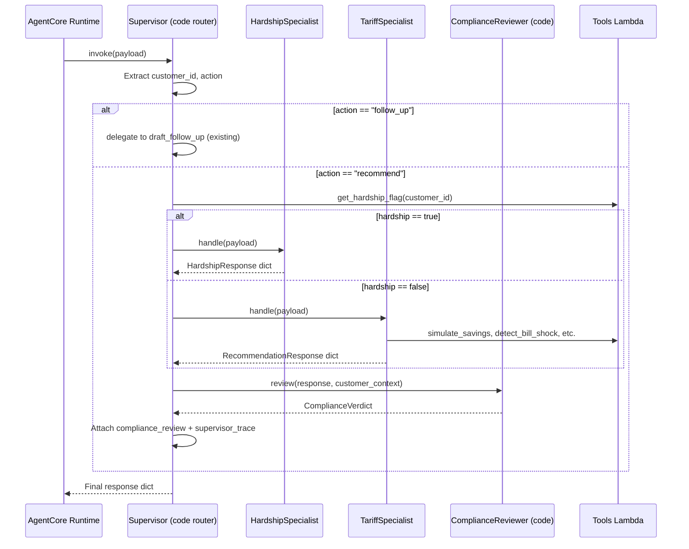

# Design Document: Multi-Agent Supervisor

## Overview

This design decomposes the monolithic `agent/agent.py::invoke()` into a multi-agent supervisor pattern with three specialist roles — **TariffSpecialist**, **HardshipSpecialist**, and **ComplianceReviewer** — orchestrated by a code-side **Supervisor** router. The Supervisor is *not* an LLM-based planner; it is a deterministic Python function that inspects the payload and customer context (hardship flag, action field) to dispatch to the correct specialist. The ComplianceReviewer is likewise deterministic code (Pydantic validation + field inspection), not an LLM turn — this keeps the latency budget (LD-4) intact.

The refactor follows the Phase 12 `CustomerDataProvider` Protocol strangler-fig pattern: define a typed `AgentRole` Protocol, implement each specialist as a class satisfying it, and wire them into the existing `@app.entrypoint invoke()` function. The external contract — payload shape in, response shape out — is unchanged. Two new public response fields (`compliance_review`, `supervisor_trace`) surface the orchestration and compliance gate for demo audiences, collapsible via the existing `?narrative=off` kill-switch (DEMO-07).

### Key Design Decisions

1. **Code-side router, not LLM planner** (Req 6.1): The Supervisor uses `if/elif` dispatch on `action` and `hardship_flag`. Zero additional LLM calls for routing — the only LLM call is the specialist's own turn.
2. **Deterministic ComplianceReviewer** (Req 6.2): Three AER NECF-aligned checks implemented as pure Python functions over the response dict. No LLM call, no network I/O. Adds microseconds, not seconds.
3. **Protocol-first specialist interface** (Req 5): `AgentRole` Protocol with a single `handle(payload: dict) -> dict` method, `@runtime_checkable`, in `agent/roles.py` with bi-mode import support.
4. **Preserve all invariants**: SAV-03, REC-03, D-15, D-04, LD-4, bi-mode imports, `_narrative_source` stripping, `runtimeSessionId` isolation — all unchanged.

## Architecture

### Component Interaction



### Module Layout

```
agent/
├── agent.py              # invoke() becomes Supervisor dispatcher
├── roles.py              # AgentRole Protocol + ComplianceVerdict schema
├── specialists/
│   ├── __init__.py
│   ├── tariff.py         # TariffSpecialist (extracted from invoke())
│   ├── hardship.py       # HardshipSpecialist (extracted from invoke())
│   └── compliance.py     # ComplianceReviewer (deterministic code)
├── providers.py          # Unchanged
├── hooks/                # Unchanged
├── memory/               # Unchanged
├── narrative/            # Unchanged
├── reasoning/            # Unchanged
├── Dockerfile            # Updated COPY for specialists/ and roles.py
└── requirements.txt      # Unchanged (no new deps)
```

All new modules follow the bi-mode import pattern: try container `/app/` layout first, fall back to `agent/` repo layout.

## Components and Interfaces

### AgentRole Protocol (`agent/roles.py`)

```python
from typing import Any, Protocol, runtime_checkable

@runtime_checkable
class AgentRole(Protocol):
    """Minimum interface for specialist agents — Phase 12 CustomerDataProvider pattern."""
    def handle(self, payload: dict[str, Any]) -> dict[str, Any]: ...
```

Follows the same `@runtime_checkable` + single-method pattern as `CustomerDataProvider`. Each specialist class implements `handle()` as its entry point.

### ComplianceVerdict & ComplianceReview Schemas (`agent/roles.py`)

```python
from pydantic import BaseModel, Field
from datetime import datetime, timezone

class ComplianceCheckResult(BaseModel):
    """Single rule check result."""
    rule: str = Field(description="Rule name (e.g. 'reference_period_disclosure')")
    verdict: str = Field(description="'pass' or 'fail'")
    reason: str = Field(description="Explanation of the verdict")

class ComplianceReview(BaseModel):
    """Public response field — the ComplianceReviewer's full verdict."""
    verdict: str = Field(description="Overall 'pass' or 'fail'")
    rules_checked: list[str] = Field(description="List of rule names checked")
    failures: list[str] = Field(description="List of failure reasons (empty on pass)")
    reviewed_at: str = Field(description="ISO 8601 timestamp")
```

### SupervisorTrace Schema (`agent/roles.py`)

```python
class SupervisorTrace(BaseModel):
    """Public response field — the Supervisor's routing decision."""
    routed_to: str = Field(description="Specialist name (e.g. 'TariffSpecialist')")
    routing_reason: str = Field(description="Brief explanation of routing decision")
    hardship_checked: bool = Field(description="Whether hardship flag was checked")
    compliance_reviewed: bool = Field(description="Whether ComplianceReviewer ran")
```

### TariffSpecialist (`agent/specialists/tariff.py`)

Extracted from the current `invoke()` recommendation path. Owns:
- The Strands `Agent` instance (`_agent`), `BedrockModel`, system prompt, 4 tools
- `FourToolCapHook` budget enforcement
- Structured output via `RecommendationResponse`
- D-01 retry-once-then-per-field-fallback chain
- `_narrative_source` and `reasoning_trace` attachment
- Shape tokens and narrative prompt composition

```python
class TariffSpecialist:
    """Tariff recommendation specialist — extracted from invoke()."""

    def __init__(self, agent: Agent, four_tool_cap: FourToolCapHook):
        self._agent = agent
        self._four_tool_cap = four_tool_cap

    def handle(self, payload: dict[str, Any]) -> dict[str, Any]:
        """Run the recommendation flow for a customer.
        
        Returns a RecommendationResponse dict with _narrative_source
        and reasoning_trace attached.
        """
        # Reset tool cap, snapshot messages, run agent, handle fallbacks
        # ... (existing invoke() recommendation logic, extracted verbatim)
```

The specialist receives the *existing* module-level `_agent` and `_four_tool_cap` instances — no new Agent construction per invocation (Req 6.4). The `handle()` method is the recommendation portion of today's `invoke()`, extracted without modification to the logic.

### HardshipSpecialist (`agent/specialists/hardship.py`)

Extracted from the current pre-LLM hardship guard in `invoke()`. Owns:
- `_build_hardship_response()` logic
- FALLBACKS bank lookup for hardship strings
- `HardshipResponse` Pydantic validation

```python
class HardshipSpecialist:
    """Hardship routing specialist — no tariff tools, no LLM turn."""

    def handle(self, payload: dict[str, Any]) -> dict[str, Any]:
        """Build a HardshipResponse for a hardship-flagged customer.
        
        Code-side only — the LLM never sees tariff context.
        """
        customer_id = payload["customer_id"]
        body = _build_hardship_response(customer_id)
        body["_narrative_source"] = {
            "hardship": {"reason": "fallback", "call_script": "fallback"},
        }
        return body
```

No tools, no Agent instance, no LLM call. The specialist is constructed without access to `simulate_savings`, `detect_bill_shock`, or `get_billing_history` (Req 2.4).

### ComplianceReviewer (`agent/specialists/compliance.py`)

Deterministic code-side checker. Three AER NECF-aligned rules:

```python
class ComplianceReviewer:
    """Deterministic compliance gate — no LLM, no network I/O."""

    def handle(self, payload: dict[str, Any]) -> dict[str, Any]:
        """Not used directly — ComplianceReviewer uses review() instead."""
        return self.review(payload.get("response", {}), payload.get("context", {}))

    def review(self, response: dict, customer_context: dict) -> ComplianceReview:
        """Run all applicable compliance checks on a specialist response."""
        checks = []
        kind = response.get("kind", "recommendation")

        if kind == "recommendation":
            checks.append(self._check_reference_period(response))
            checks.append(self._check_no_upsell_to_disadvantage(response))
        elif kind == "hardship":
            checks.append(self._check_hardship_no_tariff_data(response))

        failures = [c.reason for c in checks if c.verdict == "fail"]
        return ComplianceReview(
            verdict="fail" if failures else "pass",
            rules_checked=[c.rule for c in checks],
            failures=failures,
            reviewed_at=datetime.now(timezone.utc).isoformat(),
        )
```

**Rule implementations:**

1. **Reference-period disclosure** (Req 4.1): Checks that `reasoning_trace` contains a `get_billing_history` or `simulate_savings` entry — evidence that the response is grounded in a specific billing period. This is a structural check, not a text-content check.

2. **No upsell-to-disadvantage** (Req 4.2): Checks `saving_monthly >= 0` on both `green` and `cheapest` tracks. A non-negative saving confirms the recommended plan does not increase costs.

3. **Hardship-flag cross-check** (Req 4.3): For `kind: "hardship"` responses, verifies that `plan_id`, `saving_monthly`, and `saving_annual` fields are absent — no tariff data leaked into a hardship response.

### Supervisor (refactored `invoke()` in `agent/agent.py`)

The existing `invoke()` function becomes the Supervisor dispatcher:

```python
@app.entrypoint
def invoke(payload: dict) -> dict:
    customer_id = payload.get("customer_id", "")
    if not customer_id:
        return {"error": "customer_id is required in the payload"}

    action = payload.get("action", "recommend")
    if action == "follow_up":
        return draft_follow_up(payload)

    # --- Supervisor routing ---
    supervisor_trace = {"hardship_checked": False, "compliance_reviewed": False}
    
    # Check hardship flag (code-side, not LLM)
    hardship = False
    try:
        hardship_result = get_provider().get_hardship_flag(customer_id)
        hardship = hardship_result.get("hardship") is True
        supervisor_trace["hardship_checked"] = True
    except Exception:
        logger.warning("Hardship check failed — routing to TariffSpecialist")

    # Dispatch to specialist
    if hardship:
        response = _hardship_specialist.handle(payload)
        supervisor_trace["routed_to"] = "HardshipSpecialist"
        supervisor_trace["routing_reason"] = "Customer hardship flag is true"
    else:
        response = _tariff_specialist.handle(payload)
        supervisor_trace["routed_to"] = "TariffSpecialist"
        supervisor_trace["routing_reason"] = "Standard recommendation request"

    # Compliance review (deterministic code, not LLM)
    try:
        review = _compliance_reviewer.review(response, {"customer_id": customer_id})
        response["compliance_review"] = review.model_dump()
        supervisor_trace["compliance_reviewed"] = True
        if review.verdict == "fail":
            logger.warning("Compliance review failed: %s", review.failures)
    except Exception:
        logger.warning("ComplianceReviewer raised — returning response unchanged (D-04)")

    # Attach supervisor trace
    response["supervisor_trace"] = supervisor_trace

    # DEMO-07 kill-switch: strip post-v2.0 surfaces when ?narrative=off
    # (The narrative=off flag is passed through from the API Lambda payload)
    if payload.get("narrative") == "off":
        response.pop("compliance_review", None)
        response.pop("supervisor_trace", None)

    return response
```

Module-level specialist instances (warm-start preserved):
```python
_tariff_specialist = TariffSpecialist(_agent, _four_tool_cap)
_hardship_specialist = HardshipSpecialist()
_compliance_reviewer = ComplianceReviewer()
```

## Data Models

### Existing Models (Unchanged)

| Model | Location | Purpose |
|-------|----------|---------|
| `RecommendationResponse` | `agent/agent.py` | Dual-track tariff recommendation (green + cheapest) |
| `HardshipResponse` | `agent/agent.py` | Dignity-preserving hardship routing |
| `FollowUpEmailResponse` | `agent/agent.py` | Follow-up email draft |
| `TrackInfo` | `agent/agent.py` | Single recommendation track with D-15 validators |
| `ReasoningTraceEntry` | `agent/agent.py` | Tool-result summary for reasoning_trace |

### New Models

| Model | Location | Purpose |
|-------|----------|---------|
| `ComplianceCheckResult` | `agent/roles.py` | Single rule check (rule, verdict, reason) |
| `ComplianceReview` | `agent/roles.py` | Full compliance verdict (public response field) |
| `SupervisorTrace` | `agent/roles.py` | Routing decision (public response field) |

### Response Shape Changes

**RecommendationResponse** (extended):
```json
{
  "kind": "recommendation",
  "green": { "plan_id": "ECO", "plan_name": "EcoFlex 100", ... },
  "cheapest": { "plan_id": "VAL", "plan_name": "Value 12", ... },
  "reasoning_trace": [...],
  "_narrative_source": { ... },
  "compliance_review": {
    "verdict": "pass",
    "rules_checked": ["reference_period_disclosure", "no_upsell_to_disadvantage"],
    "failures": [],
    "reviewed_at": "2025-01-15T10:30:00+00:00"
  },
  "supervisor_trace": {
    "routed_to": "TariffSpecialist",
    "routing_reason": "Standard recommendation request",
    "hardship_checked": true,
    "compliance_reviewed": true
  }
}
```

**HardshipResponse** (extended):
```json
{
  "kind": "hardship",
  "customer_id": "CUST-006",
  "reason": "...",
  "routing_target": "hardship_team",
  "call_script": "...",
  "compliance_review": {
    "verdict": "pass",
    "rules_checked": ["hardship_no_tariff_data"],
    "failures": [],
    "reviewed_at": "2025-01-15T10:30:00+00:00"
  },
  "supervisor_trace": {
    "routed_to": "HardshipSpecialist",
    "routing_reason": "Customer hardship flag is true",
    "hardship_checked": true,
    "compliance_reviewed": true
  }
}
```

Both `compliance_review` and `supervisor_trace` are **public fields** — `api_lambda/handler.py` does NOT strip them. They collapse (are omitted) when `?narrative=off` is active (DEMO-07 kill-switch).

## Correctness Properties

*A property is a characteristic or behavior that should hold true across all valid executions of a system — essentially, a formal statement about what the system should do. Properties serve as the bridge between human-readable specifications and machine-verifiable correctness guarantees.*

### Property 1: TariffSpecialist always returns both tracks (REC-03)

*For any* valid customer_id from the known persona set, and *for any* combination of mocked LLM responses (successful structured output, StructuredOutputException, None structured_output, cancelled stop_reason), the TariffSpecialist's `handle()` method SHALL return a dict containing both `"green"` and `"cheapest"` keys, or a dict containing `"errorMessage"` (the D-04 fallback shape). No other response shape is valid.

**Validates: Requirements 3.1**

### Property 2: No upsell-to-disadvantage (non-negative savings)

*For any* RecommendationResponse dict with arbitrary `saving_monthly` float values on the `green` and `cheapest` tracks, the ComplianceReviewer's upsell-to-disadvantage check SHALL return `"pass"` if and only if both `saving_monthly` values are ≥ 0. If either value is negative, the check SHALL return `"fail"` with a reason string identifying the offending track.

**Validates: Requirements 4.2**

### Property 3: Hardship responses contain no tariff data

*For any* dict with `kind: "hardship"`, the ComplianceReviewer's hardship-flag cross-check SHALL return `"pass"` if and only if the dict contains none of the keys `plan_id`, `saving_monthly`, or `saving_annual` at the top level or nested within any sub-dict. If any of these keys are present, the check SHALL return `"fail"`.

**Validates: Requirements 4.3**

### Property 4: Reference-period disclosure grounding

*For any* RecommendationResponse dict with an arbitrary `reasoning_trace` list, the ComplianceReviewer's reference-period disclosure check SHALL return `"pass"` if and only if the `reasoning_trace` contains at least one entry with `tool` equal to `"simulate_savings"` or `"get_billing_history"`. An empty or missing `reasoning_trace` SHALL cause the check to return `"fail"`.

**Validates: Requirements 4.1**

## Error Handling

### Supervisor-Level Error Handling

The Supervisor inherits the D-04 never-500 contract. Every code path in `invoke()` must return a valid dict — never raise an unhandled exception.

| Error Scenario | Handling | Invariant |
|---|---|---|
| Missing `customer_id` | Return `{"error": "customer_id is required"}` | D-04 |
| Hardship flag check fails | Log warning, fall back to TariffSpecialist | D-04, Req 2.5 |
| TariffSpecialist raises | Caught by existing `except Exception` — deterministic savings fallback | D-04 |
| ComplianceReviewer raises | Log warning, return specialist response unchanged | D-04, Req 4.6 |
| ComplianceReviewer returns `fail` | Attach `compliance_review` with fail verdict, return response (not blocked) | D-04, Req 4.5 |

### Specialist-Level Error Handling

**TariffSpecialist**: Preserves the existing three-tier fallback chain:
1. Happy path: Strands structured output succeeds → `RecommendationResponse`
2. `StructuredOutputException`: lenient salvage → per-field fallback from FALLBACKS bank
3. Any other exception: deterministic `_fetch_deterministic_savings()` + FALLBACKS narrative

**HardshipSpecialist**: Code-side only — `_build_hardship_response()` uses FALLBACKS bank. If FALLBACKS lookup fails, the Pydantic model uses `_HARDSHIP_DEFAULTS` inline strings.

**ComplianceReviewer**: Pure Python over dicts — no I/O, no network. Exceptions are structurally unlikely (malformed response dict). The Supervisor's `try/except` around `review()` is the safety net.

### API Lambda Compatibility

`api_lambda/handler.py` requires no changes to error handling. The response shape contract is preserved:
- `green` + `cheapest` present → 200 (recommendation)
- `kind: "hardship"` → 200 (hardship)
- Neither → 404 (customer not found)
- `_narrative_source` stripped as before
- `compliance_review` and `supervisor_trace` are new public fields — NOT stripped

## Testing Strategy

### Testing Approach

**Dual testing**: unit tests for specific examples and edge cases, property-based tests for universal correctness properties on the ComplianceReviewer's pure-function checks and the TariffSpecialist's structural guarantees.

**Property-based testing IS appropriate** for this feature because:
- The ComplianceReviewer is a set of pure functions over dicts — clear input/output, large input space (arbitrary saving_monthly values, arbitrary reasoning_trace contents, arbitrary response shapes)
- The TariffSpecialist's REC-03 guarantee is a universal property across all fallback paths
- All property-testable logic is in-memory, no I/O — cost-effective at 100+ iterations

**PBT library**: `hypothesis` (already available in the project's Python test ecosystem via `requirements-dev.txt`)

**Configuration**: Minimum 100 iterations per property test. Each test tagged with:
`Feature: multi-agent-supervisor, Property {N}: {property_text}`

### Test Plan

#### Property-Based Tests (`tests/test_supervisor_properties.py`)

| Test | Property | Iterations | What Varies |
|------|----------|------------|-------------|
| `test_tariff_specialist_always_returns_both_tracks` | Property 1 | 100 | Customer ID, mocked agent result shape (success/exception/None/cancelled) |
| `test_no_upsell_to_disadvantage` | Property 2 | 100 | `saving_monthly` float values on both tracks (positive, zero, negative, edge floats) |
| `test_hardship_no_tariff_data` | Property 3 | 100 | HardshipResponse dicts with/without leaked tariff fields at various nesting levels |
| `test_reference_period_disclosure` | Property 4 | 100 | RecommendationResponse dicts with varying reasoning_trace contents (empty, missing, with/without relevant tool entries) |

#### Unit Tests — Supervisor Routing (`tests/test_supervisor.py`)

| Test | Validates |
|------|-----------|
| `test_recommend_action_dispatches_to_tariff_specialist` | Req 1.1 |
| `test_follow_up_action_dispatches_to_draft_follow_up` | Req 1.2 |
| `test_tariff_response_goes_through_compliance_review` | Req 1.3 |
| `test_hardship_response_goes_through_compliance_review` | Req 1.4 |
| `test_missing_customer_id_returns_error` | Req 1.5 |
| `test_hardship_flag_checked_before_dispatch` | Req 2.1 |
| `test_hardship_true_routes_to_hardship_specialist` | Req 2.2 |
| `test_hardship_check_failure_falls_back_to_tariff` | Req 2.5 |
| `test_compliance_fail_attaches_warning_not_blocks` | Req 4.5 |
| `test_compliance_reviewer_exception_returns_response_unchanged` | Req 4.6 |
| `test_narrative_off_strips_new_fields` | Req 9.4 |

#### Unit Tests — Specialists (`tests/test_specialists.py`)

| Test | Validates |
|------|-----------|
| `test_hardship_specialist_returns_hardship_response` | Req 2.3 |
| `test_hardship_specialist_has_no_tariff_tools` | Req 2.4 |
| `test_tariff_specialist_attaches_narrative_source` | Req 3.5 |
| `test_tariff_specialist_attaches_reasoning_trace` | Req 3.5 |

#### Unit Tests — Protocol & Schema (`tests/test_roles.py`)

| Test | Validates |
|------|-----------|
| `test_agent_role_is_runtime_checkable` | Req 5.1 |
| `test_agent_role_has_handle_method` | Req 5.2 |
| `test_all_specialists_satisfy_agent_role` | Req 5.3 |
| `test_compliance_review_schema_fields` | Req 8.4 |
| `test_supervisor_trace_schema_fields` | Req 9.2 |

#### Unit Tests — Observability (`tests/test_observability.py`)

| Test | Validates |
|------|-----------|
| `test_compliance_review_attached_on_pass` | Req 8.1 |
| `test_compliance_review_attached_on_fail` | Req 8.2 |
| `test_compliance_review_not_stripped_by_api_lambda` | Req 8.3 |
| `test_supervisor_trace_attached` | Req 9.1 |
| `test_supervisor_trace_not_stripped_by_api_lambda` | Req 9.3 |

#### Smoke Tests — Structural Invariants

| Test | Validates |
|------|-----------|
| `test_bi_mode_import_roles` | Req 5.4, 7.6 |
| `test_bi_mode_import_specialists` | Req 7.6 |
| `test_tariff_specialist_reuses_module_agent` | Req 6.4 |
| `test_compliance_reviewer_is_deterministic_code` | Req 6.2 |

#### Integration Tests — Invariant Preservation

The existing test suite (`pytest -m "not smoke"`) serves as the integration regression gate. All ~200 existing tests must continue to pass after the refactor. Key test files:
- `tests/test_agent_tools.py` — SAV-03
- `tests/test_schema.py` — REC-03, D-11 exemption
- `tests/test_narrative_validator.py` — D-15
- `tests/test_hardship.py` — hardship flow
- `tests/test_backend_api_handler.py` — API Lambda contract
- `tests/test_fallbacks_pass_validator.py` — FALLBACKS bank integrity
