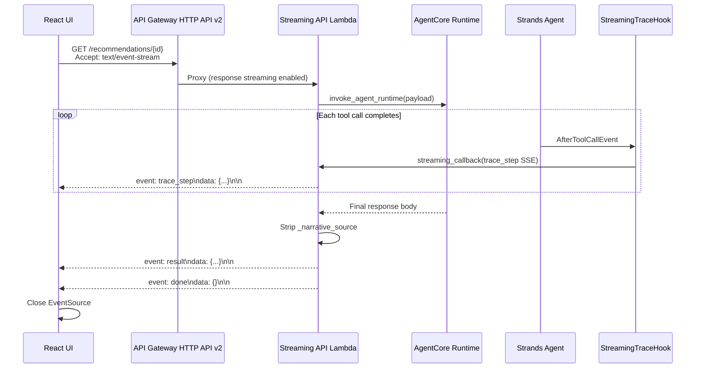
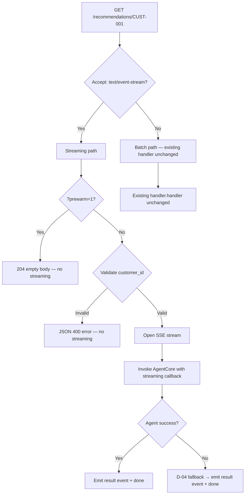

# Design Document: Streaming Reasoning Trace

## Overview

This feature replaces the current batch-at-end delivery of reasoning trace entries with real-time Server-Sent Events (SSE) streaming. As the Strands agent executes tool calls, each completed step is pushed to the UI immediately — the call-centre operator sees progressive "agent thinking" steps ("Checking billing history… Detecting bill shock pattern… Computing TOU savings…") while the agent works. The final recommendation payload still arrives as a single atomic `result` event at the end.

The design touches four layers:

1. **Agent layer** — a new Strands `HookProvider` (`StreamingTraceHook`) that emits trace events via a callback as each tool completes.
2. **API Lambda layer** — the existing `api_lambda/handler.py` gains a streaming code path that uses Lambda Response Streaming to send SSE frames when the client sends `Accept: text/event-stream`.
3. **CDK infrastructure** — the API Gateway HTTP API v2 integration switches to `HttpLambdaIntegration` with `payloadFormatVersion: 2.0` and the Lambda function URL or response streaming configuration.
4. **UI layer** — `useRecommendations` hook gains an SSE consumer path; `ReasoningTrace` component transitions from batch rendering to progressive append.

All critical invariants are preserved: SAV-03, REC-03, D-04, D-11, D-15, and the `_narrative_source` stripping contract.

## Architecture

### High-Level Flow (Streaming Path)



### Content Negotiation (Batch vs Streaming)



### Design Decisions

**D-01: Lambda Response Streaming via Function URL.** API Gateway HTTP API v2 does not natively support chunked/streaming responses from Lambda. The streaming path uses a Lambda Function URL with `InvokeMode: RESPONSE_STREAM` as the SSE transport. The existing API Gateway route remains for the batch path. The UI detects which endpoint to use based on `VITE_API_URL` (batch) vs `VITE_STREAMING_URL` (streaming Function URL). If `VITE_STREAMING_URL` is unset, the UI falls back to the batch path via API Gateway.

**D-02: SSE over WebSocket.** SSE is simpler than WebSocket for this use case — the data flow is unidirectional (server → client), the protocol is text-based and self-describing, and `EventSource` is natively supported in browsers. No bidirectional communication is needed.

**D-03: Hook-based streaming callback.** The `StreamingTraceHook` receives a callback function at construction time. The callback writes SSE-formatted bytes to the Lambda response stream. This keeps the hook decoupled from the transport — in tests, the callback can be a list append; in production, it writes to the `awslambdaric` response stream.

**D-04: Streaming callback is injected per-invocation.** The hook's `set_callback()` method is called at the start of each streaming invocation (alongside `reset()`). This avoids module-level state leaking across invocations (SC-3 pattern, same as `FourToolCapHook.reset()`).

**D-05: Batch path is the canonical fallback.** If the streaming path encounters any infrastructure error (Function URL misconfiguration, response stream failure), the client can retry without `Accept: text/event-stream` and get the existing batch response. The batch path code is untouched.

**D-06: AgentCore invoke_agent_runtime is synchronous.** The current AgentCore `invoke_agent_runtime` API returns a complete response body — it does not support server-side streaming of intermediate events. The streaming hook emits trace events by intercepting `AfterToolCallEvent` inside the agent container, but the hook's callback writes to the Lambda Function URL response stream (not to AgentCore's response). The final `result` event is constructed from the complete `invoke_agent_runtime` response after it returns.

**D-07: narrative=off suppresses trace_step events.** When the kill-switch is active, the streaming path emits only the `result` event (with reasoning_trace, compliance_review, and supervisor_trace stripped) followed by `done`. No `trace_step` events are emitted. This preserves the LD-7 contract.

## Components and Interfaces

### 1. StreamingTraceHook (agent/hooks/streaming_trace.py)

A new Strands `HookProvider` that subscribes to `AfterToolCallEvent` and emits `trace_step` SSE events via an injected callback.

```python
from __future__ import annotations
from typing import Callable, Optional
from strands.hooks import AfterToolCallEvent, HookProvider, HookRegistry

# Bi-mode import for summaries (same pattern as four_tool_cap.py)
try:
    from reasoning.summaries import (
        summary_detect_bill_shock,
        summary_get_billing_history,
        summary_get_hardship_flag,
        summary_simulate_savings,
    )
except ImportError:
    from agent.reasoning.summaries import (
        summary_detect_bill_shock,
        summary_get_billing_history,
        summary_get_hardship_flag,
        summary_simulate_savings,
    )

_TRACE_TOOLS = {
    "detect_bill_shock",
    "get_billing_history",
    "get_hardship_flag",
    "simulate_savings",
}

_SUMMARY_DISPATCH = {
    "detect_bill_shock": summary_detect_bill_shock,
    "get_billing_history": summary_get_billing_history,
    "get_hardship_flag": summary_get_hardship_flag,
    "simulate_savings": summary_simulate_savings,
}


class StreamingTraceHook(HookProvider):
    """Emits trace_step SSE events as tools complete (per-invocation lifecycle)."""

    def __init__(self) -> None:
        self._callback: Optional[Callable[[str, str], None]] = None

    def set_callback(self, callback: Callable[[str, str], None]) -> None:
        """Inject the streaming callback for this invocation."""
        self._callback = callback

    def reset(self) -> None:
        """Clear per-invocation state. Called at the top of invoke()."""
        self._callback = None

    def register_hooks(self, registry: HookRegistry, **kwargs) -> None:
        registry.add_callback(AfterToolCallEvent, self._on_tool_complete)

    def _on_tool_complete(self, event: AfterToolCallEvent) -> None:
        tool_name = event.tool_name
        if tool_name not in _TRACE_TOOLS:
            return
        if self._callback is None:
            return
        # Extract tool result and compute deterministic summary
        formatter = _SUMMARY_DISPATCH[tool_name]
        summary = formatter(event.tool_result)
        self._callback(tool_name, summary)
```

**Interface contract:**
- `set_callback(cb)` — `cb(tool_name: str, summary: str)` is called once per known tool completion.
- `reset()` — clears callback; called at invocation start.
- Coexists with `FourToolCapHook` — both subscribe to `AfterToolCallEvent` independently.

### 2. SSE Formatter (api_lambda/sse.py)

Pure functions for formatting SSE events. No I/O, no state.

```python
import json
from typing import Any

def format_sse_event(event_type: str, data: Any) -> str:
    """Format a single SSE event frame.
    
    Returns: 'event: <type>\ndata: <json>\n\n'
    """
    json_str = json.dumps(data, separators=(",", ":"))
    return f"event: {event_type}\ndata: {json_str}\n\n"

def format_done_event() -> str:
    """Format the terminal done event."""
    return "event: done\ndata: {}\n\n"
```

### 3. Streaming Handler (api_lambda/handler.py modifications)

The existing `handler()` function gains a content-negotiation branch. When `Accept: text/event-stream` is detected, it delegates to a new `_stream_handler()` function that:

1. Validates `customer_id` (same regex).
2. Checks `?prewarm=1` (returns 204, no streaming).
3. Checks `?narrative=off` (suppresses trace_step events).
4. Generates a fresh `runtimeSessionId`.
5. Invokes AgentCore with the streaming callback wired.
6. Emits `trace_step` events as tools complete.
7. Emits the `result` event with `_narrative_source` stripped.
8. Emits the `done` event.
9. On any exception: executes D-04 fallback, emits fallback as `result` + `done`.

The batch path (`handler()`) remains completely unchanged.

### 4. Lambda Function URL (infrastructure changes)

The CDK construct adds a Function URL with `InvokeMode.RESPONSE_STREAM` to the existing Lambda function. The Function URL is exposed as a separate endpoint for SSE clients.

```python
# In BackendApiConstruct
fn_url = fn.add_function_url(
    auth_type=lambda_.FunctionUrlAuthType.NONE,
    invoke_mode=lambda_.InvokeMode.RESPONSE_STREAM,
    cors=lambda_.FunctionUrlCorsOptions(
        allowed_origins=["*"],
        allowed_methods=[lambda_.HttpMethod.GET],
        allowed_headers=["Content-Type", "Accept"],
    ),
)
```

The Function URL endpoint is written to SSM and passed to the frontend as `VITE_STREAMING_URL`.

### 5. UI Streaming Consumer (ui/src/hooks/useStreamingRecommendations.ts)

A new hook that manages the SSE connection lifecycle:

```typescript
interface StreamingState {
  status: 'idle' | 'streaming' | 'success' | 'hardship' | 'error';
  traceSteps: ReasoningTraceEntry[];
  data?: RecommendationResponse;
  hardshipData?: HardshipResponse;
  httpStatus?: number;
  customerId?: string;
}
```

**State transitions:**
- `idle` → `streaming` (on lookup)
- `streaming` → `streaming` (on trace_step — append to traceSteps)
- `streaming` → `success` (on result with kind=recommendation)
- `streaming` → `hardship` (on result with kind=hardship)
- `streaming` → `error` (on error event or connection failure)
- Any → `idle` (on reset)

The hook uses `EventSource` for the SSE connection. On `done`, it closes the connection. On new lookup, it aborts any in-flight connection first.

### 6. Updated useRecommendations (ui/src/hooks/useRecommendations.ts)

The existing hook is updated to delegate to the streaming path when `VITE_STREAMING_URL` is set, or to the mock streaming simulation when `VITE_API_URL` is unset. The batch path via `VITE_API_URL` remains as fallback.

### 7. Mock Streaming Simulation (ui/src/lib/mock/streamingMock.ts)

When `VITE_API_URL` and `VITE_STREAMING_URL` are both unset, the hook simulates streaming by:
1. Emitting mock `trace_step` events from the existing `MOCK_REASONING_TRACE_CUST003` fixture (for CUST-003) or empty trace (for other personas) with ~300ms delay between each.
2. Emitting the mock `result` event from `MOCK_RECOMMENDATIONS` or `MOCK_HARDSHIP_RESPONSES`.
3. For unknown customer IDs, emitting a mock `error` event with status 404.

## Data Models

### Wire Protocol Events

All events follow the SSE format: `event: <type>\ndata: <json>\n\n`

#### trace_step

```json
{
  "tool": "detect_bill_shock",
  "summary": "Bill shock detected: +$65.16 2025-10 vs 11-month avg ($167.88 vs $102.72)"
}
```

Matches the existing `ReasoningTraceEntry` schema. Summary is produced by the deterministic formatters in `agent/reasoning/summaries.py` (SAV-03 by construction, D-11 exemption preserved).

#### result

```json
{
  "kind": "recommendation",
  "green": { "plan_id": "ECO", "plan_name": "EcoFlex 100", "saving_monthly": 30.00, ... },
  "cheapest": { "plan_id": "VAL", "plan_name": "Value 12", "saving_monthly": 55.00, ... },
  "reasoning_trace": [...]
}
```

Identical to the existing batch JSON response. `_narrative_source` is stripped before emission. Both `green` and `cheapest` tracks are always present (REC-03). For hardship responses, `kind` is `"hardship"`.

#### error

```json
{
  "status": 502,
  "message": "Recommendation service error. Please try again."
}
```

Maps to the same error taxonomy as the batch path (400, 404, 502, 504).

#### done

```json
{}
```

Terminal event. Always the last event in every stream.

### Pydantic Models (no changes)

The existing `ReasoningTraceEntry`, `RecommendationResponse`, and `HardshipResponse` models in `agent/agent.py` are unchanged. The streaming path serialises the same model instances.

### TypeScript Types (minimal additions)

```typescript
// New SSE event types for the streaming consumer
interface TraceStepEvent {
  tool: string;
  summary: string;
}

interface ErrorEvent {
  status: number;
  message: string;
}

// StreamingState added to useRecommendations (see Components section)
```

## Correctness Properties

*A property is a characteristic or behavior that should hold true across all valid executions of a system — essentially, a formal statement about what the system should do. Properties serve as the bridge between human-readable specifications and machine-verifiable correctness guarantees.*

### Property 1: Customer ID validation rejects all non-matching inputs

*For any* string that does not match the pattern `^CUST-\d{3,6}$`, the streaming handler SHALL return an error (HTTP 400 in batch mode, or a JSON error before opening the stream) and SHALL NOT initiate an AgentCore invocation.

**Validates: Requirements 1.3**

### Property 2: Session ID uniqueness across invocations

*For any* N sequential streaming invocations, all N generated `runtimeSessionId` values SHALL be distinct valid uuid4 strings.

**Validates: Requirements 1.4**

### Property 3: _narrative_source is never exposed to the client

*For any* agent response payload that contains a `_narrative_source` key, the `result` SSE event emitted to the client SHALL NOT contain that key.

**Validates: Requirements 2.3, 4.1**

### Property 4: Every stream terminates with exactly one done event

*For any* streaming invocation (whether the agent succeeds, fails, times out, or hits the D-04 fallback), the event sequence SHALL end with exactly one `done` event and no events SHALL follow it.

**Validates: Requirements 2.5, 4.4**

### Property 5: Summary integrity — deterministic formatters, no narrative filtering

*For any* valid tool result payload for a tool in `{detect_bill_shock, get_billing_history, get_hardship_flag, simulate_savings}`, the `summary` field in the emitted `trace_step` event SHALL equal the output of the corresponding deterministic formatter in `agent/reasoning/summaries.py`, with no narrative filtering applied (digits, currency symbols, percentages, and dates preserved).

**Validates: Requirements 2.6, 4.3**

### Property 6: Unknown tools are silently skipped

*For any* tool name that is NOT in the set `{detect_bill_shock, get_billing_history, get_hardship_flag, simulate_savings}`, the `StreamingTraceHook` SHALL NOT invoke the streaming callback and SHALL NOT raise an exception.

**Validates: Requirements 3.3**

### Property 7: REC-03 preserved in streaming result events

*For any* streaming result event where the response `kind` is `"recommendation"`, the payload SHALL contain both `green` and `cheapest` track objects.

**Validates: Requirements 4.2**

### Property 8: SSE framing format

*For any* event type in `{trace_step, result, error, done}` and *for any* valid JSON-serialisable data object, the formatted SSE event SHALL match the pattern `event: <type>\ndata: <json>\n\n` where `<json>` is a single-line JSON string with no embedded newlines.

**Validates: Requirements 8.1**

### Property 9: ReasoningTraceEntry round-trip serialisation

*For any* valid `ReasoningTraceEntry` object (with arbitrary `tool` string and `summary` string), serialising it to a `trace_step` SSE event and then parsing the SSE event back SHALL produce an equivalent `ReasoningTraceEntry` object.

**Validates: Requirements 8.4**

## Error Handling

### Streaming Path Errors

| Scenario | Behavior | Event Sequence |
|---|---|---|
| Invalid customer_id | JSON 400 error before stream opens | No SSE events |
| ?prewarm=1 | HTTP 204 empty body | No SSE events |
| AgentCore timeout (ReadTimeoutError) | D-04 fallback fires | `result` (fallback) → `done` |
| AgentCore ClientError | D-04 fallback fires | `result` (fallback) → `done` |
| Unexpected exception in agent | D-04 fallback fires | `result` (fallback) → `done` |
| Streaming callback write failure | Log warning, continue | Partial trace; `result` → `done` still emitted |
| Customer not found (empty billing) | Error event | `error` (404) → `done` |

### D-04 Never-500 in Streaming Mode

The streaming path wraps the entire AgentCore invocation in the same `try/except Exception` pattern as the batch path. On any exception:

1. The D-04 fallback path fires (calls Tools Lambda directly, stitches fallback narrative).
2. The fallback response is emitted as a `result` event.
3. A `done` event is emitted.
4. The stream closes.

No `error` event is emitted for D-04 fallback scenarios — the client receives a valid `result` event with fallback data. The `error` event is reserved for cases where even the fallback path cannot produce a valid response (e.g., customer not found).

### UI Error Handling

- **EventSource `onerror`**: If the SSE connection drops unexpectedly (network failure, Lambda timeout), the UI transitions to the error state with `httpStatus: 0` (same as the existing fetch error path).
- **Abort on re-query**: When the user submits a new customer ID, the in-flight `EventSource` is closed before opening a new one (same pattern as the existing `AbortController`).
- **Mock mode errors**: Unknown customer IDs in mock mode emit a mock `error` event with status 404 (same behavior as the existing mock path).

## Testing Strategy

### Property-Based Tests (Hypothesis, minimum 100 iterations each)

Property-based testing is appropriate for this feature because the SSE formatting, serialisation round-trips, and input validation logic are pure functions with clear input/output behavior and large input spaces.

**Library:** Hypothesis (already in `requirements-dev.txt`)

Each property test references its design document property and runs a minimum of 100 iterations.

**Tag format:** `Feature: streaming-reasoning-trace, Property N: <property_text>`

| Property | Test Target | Generator Strategy |
|---|---|---|
| P1: Customer ID validation | `_validate_customer_id()` or handler branch | Random strings (ASCII, unicode, partial matches, empty) |
| P2: Session ID uniqueness | Handler invocation | N random invocations, collect session IDs |
| P3: _narrative_source stripping | `_format_result_event()` | Random dicts with/without `_narrative_source` |
| P4: Done event terminal | Full stream simulation | Random success/failure scenarios |
| P5: Summary integrity | `StreamingTraceHook._on_tool_complete()` | Random tool result payloads per tool type |
| P6: Unknown tools skipped | `StreamingTraceHook._on_tool_complete()` | Random tool names excluding known set |
| P7: REC-03 in result events | `_format_result_event()` | Random RecommendationResponse payloads |
| P8: SSE framing format | `format_sse_event()` | Random event types + JSON-serialisable dicts |
| P9: Round-trip serialisation | `format_sse_event()` + SSE parser | Random ReasoningTraceEntry objects |

### Unit Tests (pytest + vitest)

**Backend (pytest):**
- Content negotiation: `Accept: text/event-stream` → streaming path; absent → batch path
- Prewarm bypass: `?prewarm=1` returns 204 regardless of Accept header
- `?narrative=off` suppresses trace_step events
- D-04 fallback emits result + done (not error)
- Follow-up endpoint ignores Accept header (always JSON)
- Error event shape for each error scenario (400, 404, 502, 504)
- StreamingTraceHook registers for AfterToolCallEvent
- StreamingTraceHook coexists with FourToolCapHook
- StreamingTraceHook.reset() clears callback
- SSE formatter output for each event type

**Frontend (vitest):**
- useRecommendations delegates to SSE when VITE_STREAMING_URL is set
- trace_step events append to traceSteps array
- result event transitions to success/hardship state
- done event closes EventSource
- error event transitions to error state
- Abort on re-query closes existing EventSource
- Mock streaming simulation emits events with delays
- Mock streaming uses same fixtures as batch mock
- Mock unknown customer ID emits 404 error
- ReasoningTrace component renders progressive entries
- Skeletons + trace steps visible during streaming state

### Integration Tests (pytest -m smoke)

- End-to-end SSE stream against deployed Function URL
- Verify trace_step events arrive before result event
- Verify done event is the terminal event
- Verify batch path still works via API Gateway
- Verify prewarm path unchanged
