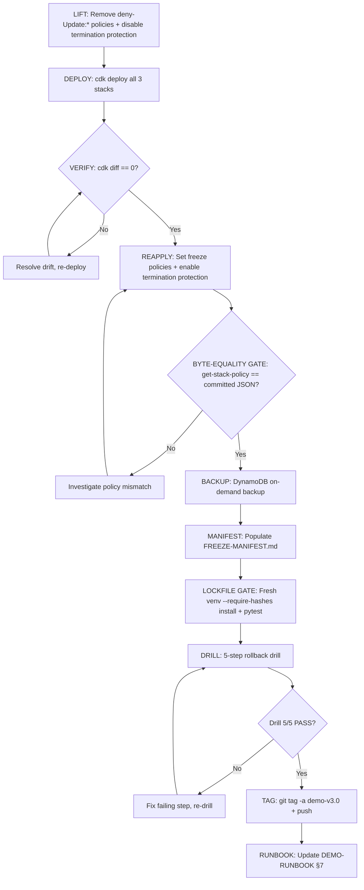

# Design Document — v3.0 Freeze Ceremony (Phase 17)

## Overview

Phase 17 locks the v3.0 demo surface behind an annotated `demo-v3.0` git tag with deny-Update:* CloudFormation stack policies, a fresh DynamoDB backup, a self-consistent FREEZE-MANIFEST, and a proven 5/5 rollback drill. This is an operator-driven ceremony — no new application code is written. The deliverables are:

1. **FREEZE-MANIFEST.md** — byte-level identity of the v3.0 demo (commit SHAs, lockfile hashes, dist/synth hashes, backup ARN, Memory ID, break-glass commands)
2. **Drill log** — 5-step rollback drill with per-step PASS/FAIL verdicts and ISO-8601 timestamps
3. **DEMO-RUNBOOK §7 update** — v3.0 ceremony evidence replacing the v2.0 record
4. **`demo-v3.0` annotated tag** — WN-2 self-consistent, pushed to origin

The ceremony follows the exact pattern established in v2.0 Phase 10 (LD-6), adapted for the v3.0 surface: 6 personas, multi-tool reasoning trace, hardship short-circuit, follow-up email via AgentCore Memory, and the `bedrock-agentcore==1.6.4` dependency bump.

### Design Rationale

The ceremony is deliberately manual and scripted rather than automated because:
- **Human checkpoints** catch environmental drift that automation would silently pass (e.g., stale AWS profiles, unexpected cdk diff output)
- **Reproducibility** comes from the evidence chain (hashes, ARNs, commit SHAs), not from re-running automation
- **The v2.0 ceremony pattern proved out** — 5/5 drill PASS, zero post-freeze incidents, clean rollback to `demo-v1.0` during the drill

---

## Architecture

The ceremony is a linear sequence of operator-executed steps with verification gates between each phase. There is no new application architecture — the ceremony operates on the existing v3.0 stack surface.

### Ceremony Sequence Diagram



### Stack Surface

| Stack | CDK Class | What It Contains (v3.0) |
|-------|-----------|------------------------|
| CustomerTariff | `foundation_stack.py` | DynamoDB `tariff-billing` (73+ rows, 6 personas), Tools Lambda (6-plan dispatcher + `detect_bill_shock_pure` + `get_hardship_flag_pure`) |
| CustomerTariffAgent | `agentcore_stack.py` | AgentCore Runtime (`tariff_agent-O2Hai86N8V`), AgentCore Memory (short-term, 12h TTL), Strands agent container |
| CustomerTariffApi | `backend_api_stack.py` | API Gateway HTTP v2, API Lambda (`live` alias), `/recommendations/{id}` + `/recommendations/{id}/follow-up` routes |

### Environment Constants

```
AWS Account:       588738606436
Region:            us-east-1
Profile:           cevo-dev25
Python:            /opt/homebrew/bin/python3.13
Bedrock Model:     us.anthropic.claude-sonnet-4-6
Agent Runtime ARN: arn:aws:bedrock-agentcore:us-east-1:588738606436:runtime/tariff_agent-O2Hai86N8V
API Endpoint:      https://y9w9qwegwe.execute-api.us-east-1.amazonaws.com/
v2.0 Backup ARN:   arn:aws:dynamodb:us-east-1:588738606436:table/tariff-billing/backup/01777208516554-e1bee933
```

---

## Components and Interfaces

The ceremony has no software components in the traditional sense. Instead, it has **operator steps** that interface with existing tools and AWS services.

### Step 1: LIFT — Remove Existing v2.0 Stack Policies

**Purpose:** Unlock the 3 stacks so `cdk deploy` can reconcile code-to-deployed state.

**Commands:**
```bash
# Apply allow-all policies
aws cloudformation set-stack-policy --stack-name CustomerTariff \
    --stack-policy-body file://infrastructure/stack-policies/foundation-allow-all.json \
    --region us-east-1 --profile cevo-dev25
aws cloudformation set-stack-policy --stack-name CustomerTariffAgent \
    --stack-policy-body file://infrastructure/stack-policies/agentcore-allow-all.json \
    --region us-east-1 --profile cevo-dev25
aws cloudformation set-stack-policy --stack-name CustomerTariffApi \
    --stack-policy-body file://infrastructure/stack-policies/backend-api-allow-all.json \
    --region us-east-1 --profile cevo-dev25

# Disable termination protection
for stack in CustomerTariff CustomerTariffAgent CustomerTariffApi; do
  aws cloudformation update-termination-protection --no-enable-termination-protection \
      --stack-name "$stack" --region us-east-1 --profile cevo-dev25
done
```

**Verification:** `aws cloudformation describe-stacks` confirms `EnableTerminationProtection: false` on all 3 stacks. `aws cloudformation get-stack-policy` returns the allow-all body for each.

### Step 2: DEPLOY — Reconcile Code to Deployed State

**Purpose:** Deploy all 3 stacks so the CloudFormation state matches the v3.0 codebase at HEAD.

**Command:**
```bash
cdk deploy CustomerTariff CustomerTariffAgent CustomerTariffApi --require-approval never
```

**Verification:** All 3 stacks reach `UPDATE_COMPLETE` or `CREATE_COMPLETE`.

### Step 3: VERIFY — cdk diff == 0

**Purpose:** Prove zero drift between code and deployed state.

**Command:**
```bash
cdk diff CustomerTariff CustomerTariffAgent CustomerTariffApi
```

**Gate:** Output must show zero differences across all 3 stacks. If any diff exists, resolve and re-deploy before proceeding.

### Step 4: REAPPLY — Freeze Policies + Termination Protection

**Purpose:** Lock the stacks against accidental drift.

**Commands:**
```bash
# Apply freeze (deny-Update:*) policies
aws cloudformation set-stack-policy --stack-name CustomerTariff \
    --stack-policy-body file://infrastructure/stack-policies/foundation-freeze.json \
    --region us-east-1 --profile cevo-dev25
aws cloudformation set-stack-policy --stack-name CustomerTariffAgent \
    --stack-policy-body file://infrastructure/stack-policies/agentcore-freeze.json \
    --region us-east-1 --profile cevo-dev25
aws cloudformation set-stack-policy --stack-name CustomerTariffApi \
    --stack-policy-body file://infrastructure/stack-policies/backend-api-freeze.json \
    --region us-east-1 --profile cevo-dev25

# Re-enable termination protection
for stack in CustomerTariff CustomerTariffAgent CustomerTariffApi; do
  aws cloudformation update-termination-protection --enable-termination-protection \
      --stack-name "$stack" --region us-east-1 --profile cevo-dev25
done
```

**Byte-Equality Gate:** For each stack, `aws cloudformation get-stack-policy --stack-name <name>` output must be byte-equivalent to the corresponding committed freeze JSON under `infrastructure/stack-policies/`. This is asserted via pytest before the tag is cut.

### Step 5: BACKUP — DynamoDB Freeze Backup

**Purpose:** Create a point-in-time backup of the v3.0 data layer.

**Command:**
```bash
aws dynamodb create-backup \
    --table-name tariff-billing \
    --backup-name "tariff-billing-v3.0-freeze-$(date -u +%Y%m%dT%H%M%SZ)" \
    --region us-east-1 --profile cevo-dev25
```

**Verification:**
- `aws dynamodb describe-backup --backup-arn <arn>` returns `BackupStatus: AVAILABLE`
- Backup ARN differs from v2.0 backup ARN (`01777208516554-e1bee933`) — single-backup-per-milestone invariant

### Step 6: MANIFEST — Populate FREEZE-MANIFEST.md

**Purpose:** Capture the byte-level identity of the v3.0 demo.

**Location:** `.planning/milestones/v3.0-phases/17-freeze-ceremony/FREEZE-MANIFEST.md`

**Hash computation commands:**
```bash
# Lockfile hashes
sha256sum requirements.txt
sha256sum requirements-dev.txt
sha256sum ui/package-lock.json

# Dist bundle hashes
scripts/hash_dist.sh ui/dist
scripts/hash_dist.sh ui/dist-mock

# Synth asset hashes (after cdk synth)
cdk synth
for d in cdk.out/asset.*/; do
  echo "$d: $(scripts/hash_synth_assets.sh "$d")"
done
```

**Commit:** The populated manifest is committed as an atomic commit on `main`. The SHA of this commit becomes `freeze_commit_sha`.

### Step 7: LOCKFILE GATE — Fresh Venv Reproducibility

**Purpose:** Prove the hash-pinned lockfiles reproduce a working environment.

**Commands:**
```bash
/opt/homebrew/bin/python3.13 -m venv /tmp/freeze-gate-venv
/tmp/freeze-gate-venv/bin/pip install --require-hashes -r requirements.txt
/tmp/freeze-gate-venv/bin/pip install --require-hashes -r requirements-dev.txt
npm ci --prefix ui
/tmp/freeze-gate-venv/bin/pytest -m "not smoke"
```

**Gate:** All commands exit 0. The pytest pass count is recorded in the manifest.

### Step 8: DRILL — 5-Step Rollback Drill

See the Drill Procedure section below.

### Step 9: TAG — Cut and Push demo-v3.0

**Purpose:** Create the immutable reference point for the v3.0 demo.

**Commands:**
```bash
# Commit the drill log (one commit past the manifest commit)
git add .planning/milestones/v3.0-phases/17-freeze-ceremony/
git commit -m "chore(17): v3.0 freeze drill log — 5/5 PASS"

# Cut annotated tag
git tag -a demo-v3.0 -m "v3.0 freeze — $(date -u +%Y-%m-%dT%H:%M:%SZ)
freeze_commit_sha: $(git rev-parse HEAD^)
manifest: .planning/milestones/v3.0-phases/17-freeze-ceremony/FREEZE-MANIFEST.md"

# Verify WN-2 self-consistency
MANIFEST_SHA=$(git rev-list -n 1 demo-v3.0^)
echo "Tag parent: $MANIFEST_SHA"
# Must equal freeze_commit_sha in the manifest
```

**Push:**
```bash
git push origin main
git push origin demo-v3.0
```

**Verification:** `git ls-remote --tags origin` shows both the tag object ref and the dereferenced commit ref for `demo-v3.0`.

### Step 10: RUNBOOK UPDATE — DEMO-RUNBOOK §7

**Purpose:** Update the presenter-facing runbook with v3.0 ceremony evidence.

**Content:** Replace the v2.0 ceremony record in §7 with v3.0 evidence: tag SHA, manifest path, drill log path, drill summary table, DynamoDB backup ARN.

### Step 11: PREWARM LATENCY GATE (T-24h)

**Purpose:** Verify warm median latency per persona stays under the per-flow gate.

**Command:**
```bash
BACKEND_API_URL=https://y9w9qwegwe.execute-api.us-east-1.amazonaws.com/ \
    python3 scripts/prewarm.py
```

**Gates:**
- Single-tool personas (CUST-001, CUST-002, CUST-004, CUST-005): warm median < 3000ms
- Multi-tool persona (CUST-003 Elena): warm median < 2500ms
- Exit code 0 = all gates pass

---

## Data Models

### FREEZE-MANIFEST.md Structure (v3.0)

The manifest follows the v2.0 template structure with these v3.0 additions: `memory_id`, `agent_runtime_arn`, `api_endpoint`, and updated lockfile hashes reflecting `bedrock-agentcore==1.6.4`.

```yaml
git:
  freeze_commit_sha: "<sha256>"          # SHA of the manifest commit (tag^ per WN-2)
  freeze_timestamp_utc: "<ISO-8601>"     # UTC timestamp of the manifest commit
  tag: demo-v3.0

lockfiles:
  requirements_txt: "sha256:<hash>"       # 62+ prod entries incl. bedrock-agentcore==1.6.4
  requirements_dev_txt: "sha256:<hash>"   # 33+ dev entries
  ui_package_lock_json: "sha256:<hash>"

dist_bundles:
  ui_dist: "sha256:<hash>"               # scripts/hash_dist.sh ui/dist
  ui_dist_mock: "sha256:<hash>"           # scripts/hash_dist.sh ui/dist-mock

synth_assets:                             # One entry per cdk.out/asset.*/ directory
  - logical: "<CDK logical ID>"
    asset_hash: "<CDK content hash>"
    bundle_sha256: "sha256:<hash>"        # scripts/hash_synth_assets.sh output

cloudformation:
  FoundationStack: "arn:aws:cloudformation:us-east-1:588738606436:stack/CustomerTariff/<guid>"
  AgentCoreStack: "arn:aws:cloudformation:us-east-1:588738606436:stack/CustomerTariffAgent/<guid>"
  BackendApiStack: "arn:aws:cloudformation:us-east-1:588738606436:stack/CustomerTariffApi/<guid>"

bedrock_model_id: "us.anthropic.claude-sonnet-4-6"

# v3.0 additions (not present in v2.0 manifest)
agent_runtime_arn: "arn:aws:bedrock-agentcore:us-east-1:588738606436:runtime/tariff_agent-O2Hai86N8V"
api_endpoint: "https://y9w9qwegwe.execute-api.us-east-1.amazonaws.com/"
memory_id: "<AgentCore Memory resource ID from SSM /customer-tariff/memory-id>"

dynamodb_backup:
  table_name: tariff-billing
  backup_arn: "arn:aws:dynamodb:us-east-1:588738606436:table/tariff-billing/backup/<id>"
  backup_timestamp_utc: "<ISO-8601>"

break_glass:
  unlock_stack_policies: |
    aws cloudformation set-stack-policy --stack-name CustomerTariff \
        --stack-policy-body file://infrastructure/stack-policies/foundation-allow-all.json \
        --region us-east-1 --profile cevo-dev25
    aws cloudformation set-stack-policy --stack-name CustomerTariffAgent \
        --stack-policy-body file://infrastructure/stack-policies/agentcore-allow-all.json \
        --region us-east-1 --profile cevo-dev25
    aws cloudformation set-stack-policy --stack-name CustomerTariffApi \
        --stack-policy-body file://infrastructure/stack-policies/backend-api-allow-all.json \
        --region us-east-1 --profile cevo-dev25

  disable_termination_protection: |
    for stack in CustomerTariff CustomerTariffAgent CustomerTariffApi; do
      aws cloudformation update-termination-protection --no-enable-termination-protection \
          --stack-name "$stack" --region us-east-1 --profile cevo-dev25
    done

  after_fix: |
    # After applying the emergency fix:
    #   1. Reapply deny-Update:* policies (swap -allow-all.json -> -freeze.json)
    #   2. Re-enable termination protection
    #   3. Recompute all manifest hashes
    #   4. Commit updated FREEZE-MANIFEST.md and cut demo-v3.0.1
```

### Drill Log Structure

```markdown
# v3.0 Rollback Drill Log

| Step | What was drilled | Evidence | Verdict |
|------|------------------|----------|---------|
| 1 | `?narrative=off` kill switch | DOM assertions at 1280x800 | PASS/FAIL |
| 2 | `npm run build:mock` <10s + hash match | Wall-clock time + hash comparison | PASS/FAIL |
| 3 | `git checkout demo-v2.0` + pytest green | pytest exit code + pass/deselect counts | PASS/FAIL |
| 4 | DynamoDB restore + spot-check | Scan count + persona spot-checks | PASS/FAIL |
| 5 | Scratch table teardown | ResourceNotFoundException confirmed | PASS/FAIL |

Overall: PASS/FAIL
```

### 5-Step Rollback Drill Procedure

| Step | Action | Success Criteria |
|------|--------|-----------------|
| 1 | Open `http://localhost:4173/?narrative=off` at 1280×800 | Reasoning trace, hardship banner, and follow-up email drawer all collapsed to v2.0 shape |
| 2 | `rm -rf ui/dist-mock && npm run build:mock --prefix ui` | Build completes in <10s; `scripts/hash_dist.sh ui/dist-mock` matches manifest value |
| 3 | Fresh clone → `git checkout demo-v2.0` → `pytest -m "not smoke"` | Exit code 0 (expect ~87 passed / ~23 deselected — v2.0 test surface) |
| 4 | `aws dynamodb restore-table-from-backup --target-table-name tariff-billing-rollback-drill --backup-arn <arn>` → scan count → spot-check 5 personas at month 2025-04 | Scan count matches expected (60 billing + 5 PROFILE + CUST-006 records); all 5 recommendation personas return non-null `usage_kwh` at 2025-04 |
| 5 | `aws dynamodb delete-table --table-name tariff-billing-rollback-drill` → `aws dynamodb describe-table` | `ResourceNotFoundException` confirms clean teardown |

### WN-2 Self-Consistency Invariant

The two-commit pattern ensures the manifest commit SHA is verifiable from the tag:

```
commit N:   "chore(17): v3.0 FREEZE-MANIFEST" ← freeze_commit_sha in manifest
commit N+1: "chore(17): v3.0 freeze drill log — 5/5 PASS" ← demo-v3.0 tag points here
```

Verification: `git rev-list -n 1 demo-v3.0^` must equal the `freeze_commit_sha` value inside the manifest YAML.

---

## Error Handling

This phase has no application-level error handling. Instead, it has **operator decision points**:

| Failure Mode | Detection | Resolution |
|-------------|-----------|------------|
| `cdk deploy` fails on one stack | Stack status != `UPDATE_COMPLETE` | Diagnose CloudFormation events, fix, re-deploy |
| `cdk diff` shows non-zero drift | Non-empty diff output | Re-deploy the drifted stack, re-verify |
| Stack policy byte-equality fails | pytest assertion failure | Re-apply the correct freeze JSON, re-verify |
| DynamoDB backup not AVAILABLE | `describe-backup` status check | Wait up to 10 minutes; if still not available, investigate |
| Lockfile `--require-hashes` fails | pip non-zero exit | Lockfile drift detected — regenerate via `pip-compile` and restart ceremony |
| Drill step fails | Per-step PASS/FAIL verdict | Fix the failing lever, re-run that drill step |
| Prewarm latency gate fails | `prewarm.py` exit code 1 | Record measured latency; operator go/no-go based on overshoot magnitude |
| WN-2 self-consistency fails | SHA mismatch | Re-examine commit sequence; likely the manifest was amended after the tag was cut — re-tag |

### Break-Glass Procedure (Post-Freeze Emergency)

If a critical bug requires an infra change after the tag is cut:

1. Lift stack policies using the `break_glass.unlock_stack_policies` commands in the manifest
2. Disable termination protection using `break_glass.disable_termination_protection`
3. Apply the fix and re-deploy
4. Re-apply freeze policies and termination protection
5. Recompute all manifest hashes
6. Commit updated FREEZE-MANIFEST.md
7. Cut a patch tag (`demo-v3.0.1`)

---

## Testing Strategy

### Why Property-Based Testing Does Not Apply

This feature is an operator-driven ceremony producing no new application code. The deliverables are documentation artefacts (FREEZE-MANIFEST, drill log, runbook update) and infrastructure state changes (stack policies, DynamoDB backup, git tag). There are no pure functions, parsers, serializers, or algorithms to test with PBT. The appropriate testing strategies are:

- **Smoke tests** — stack policy verification, termination protection status
- **Integration tests** — `cdk diff == 0`, DynamoDB backup status, lockfile reproducibility
- **Example-based assertions** — byte-equality gates, WN-2 self-consistency, hash comparisons
- **Manual verification** — drill steps with human go/no-go checkpoints

### Verification Gates (Automated)

| Gate | Tool | What It Asserts |
|------|------|----------------|
| Stack policy byte-equality | pytest | `get-stack-policy` output == committed freeze JSON for all 3 stacks |
| Termination protection | AWS CLI | `EnableTerminationProtection: true` on all 3 stacks |
| cdk diff == 0 | CDK CLI | Zero drift between code and deployed state |
| Lockfile reproducibility | pip + npm | `--require-hashes` install succeeds in fresh venv; `npm ci` succeeds |
| Offline pytest green | pytest | `pytest -m "not smoke"` exits 0 |
| WN-2 self-consistency | git + shell | `git rev-list -n 1 demo-v3.0^` == manifest `freeze_commit_sha` |
| Prewarm latency | `scripts/prewarm.py` | Warm median under per-flow gate (3000ms / 2500ms) |

### Verification Gates (Manual — Drill Steps)

| Gate | What the Operator Checks |
|------|-------------------------|
| `?narrative=off` kill switch | All v3.0 surfaces collapse to v2.0 shape at 1280×800 |
| `build:mock` emergency swap | Build <10s, hash matches manifest |
| `demo-v2.0` rollback | Fresh-clone pytest green on v2.0 tag |
| DynamoDB restore | Scan count correct, persona spot-checks pass |
| Scratch teardown | `ResourceNotFoundException` on describe-table |

### Test Execution Order

1. **Pre-tag:** Stack policy byte-equality pytest + termination protection check
2. **Pre-tag:** Lockfile gate (fresh venv `--require-hashes` + pytest)
3. **Pre-tag:** 5-step rollback drill (manual, logged)
4. **Post-tag:** WN-2 self-consistency verification
5. **T-24h:** Prewarm latency gate
